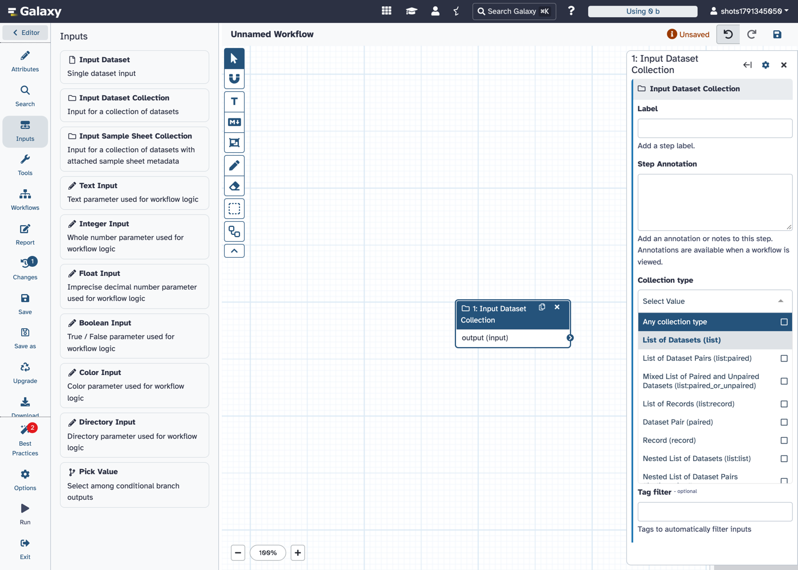
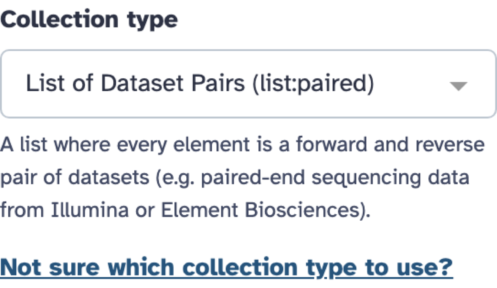
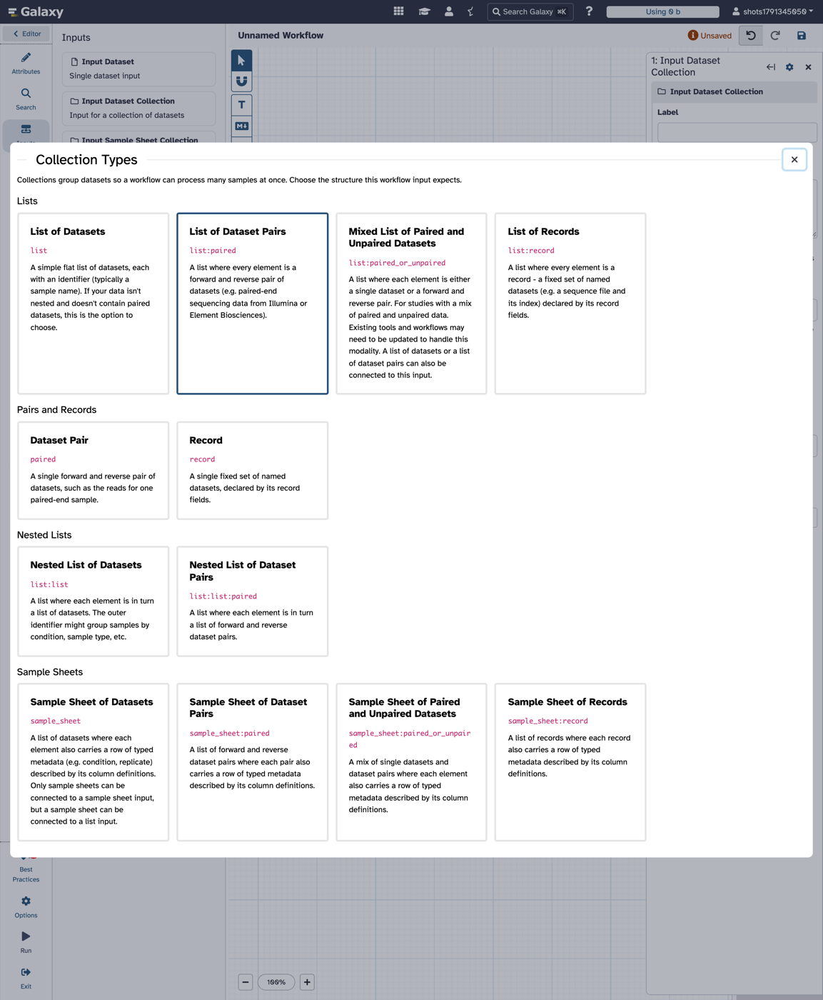
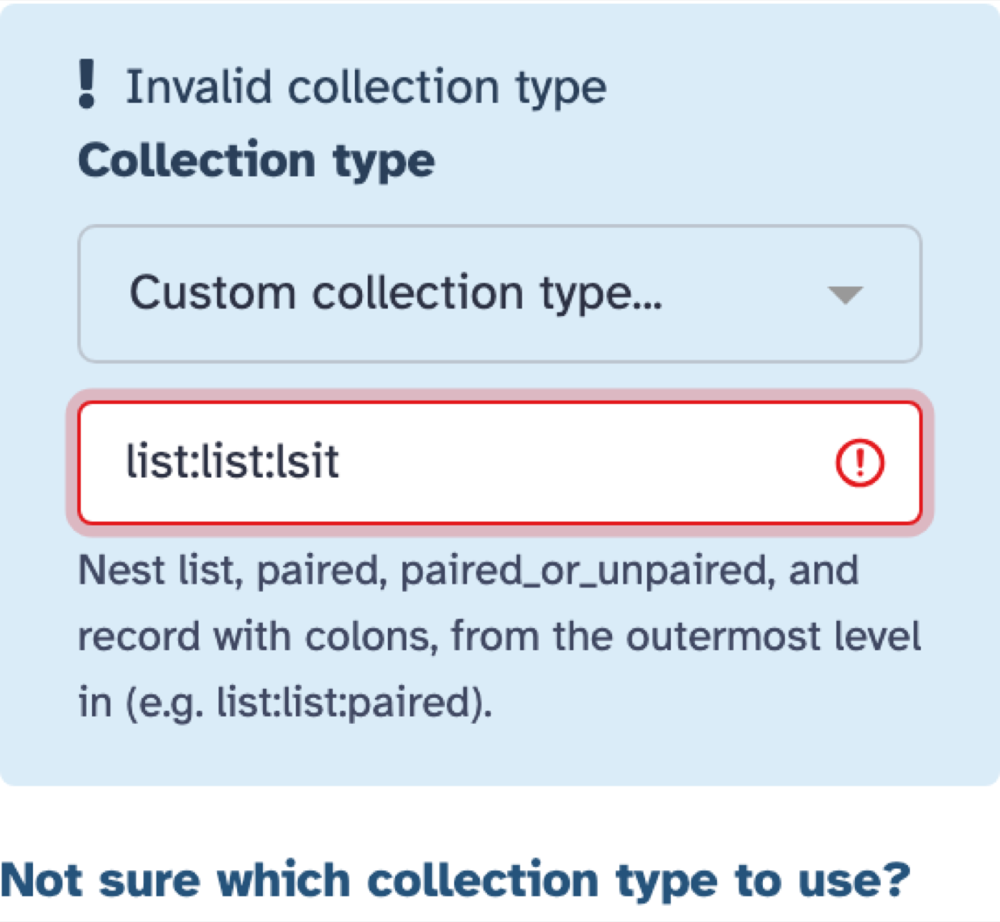
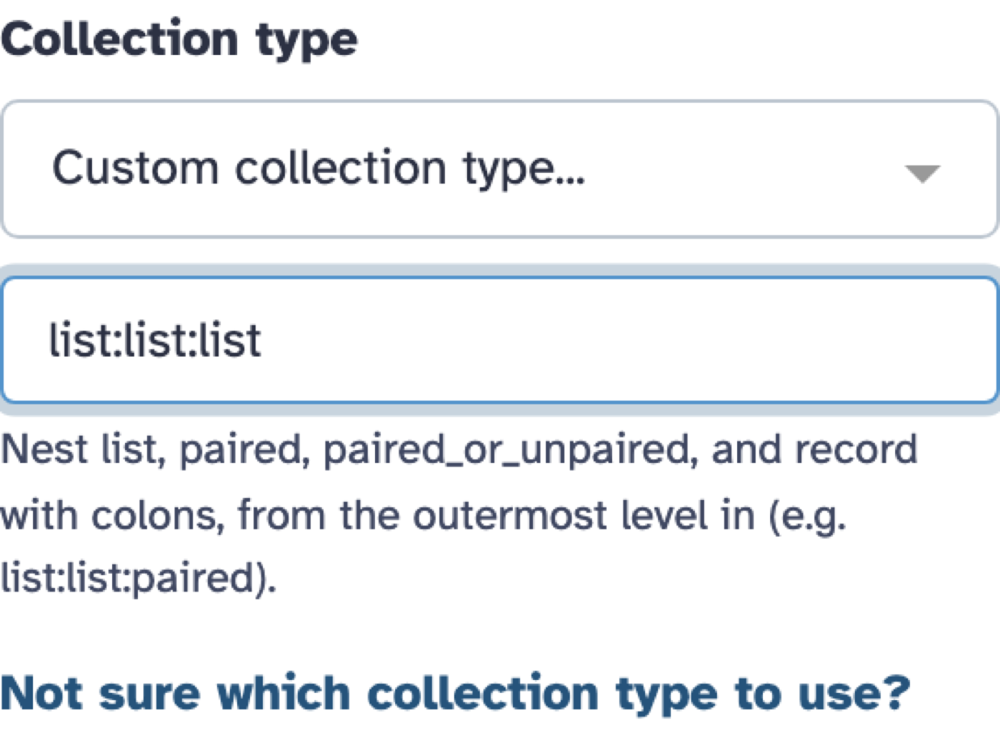

Implement 🎯 #19049 - pick a workflow collection input's type from a described select instead of a free-text field, built on a new reusable select-or-text form element.

On `dev` the editor asks for a collection input's type in a text box. Its suggestions are a `datalist`, so they only show up once you start typing something that matches, and nothing on the form says what `list:paired_or_unpaired` or `sample_sheet:record` means or which one fits your data. This branch makes it a select of the known types, with each type's description under it, a custom mode for any other type, and a "Not sure which collection type to use?" dialog that explains them all.

| Pick a known type | Each choice is described |
| --- | --- |
|  |  |

| "Not sure which collection type to use?" opens a dialog of cards; clicking one picks it |
| --- |
|  |

| Custom mode for anything else, validated as you type | |
| --- | --- |
|  |  |

The select and custom mode are a new form element, `FormSelectOrText`: the "variant of a GFormInput that can fluidly switch between a text input field and a dropdown selector" suggested in the issue thread. It lists known values in a select and offers an "Other..." entry that switches to a validated text field. It emits only valid values and reports errors through `FormElement`'s alert, and options can carry help text that shows while they're selected. It's available as `FormElement` type `select_or_text`. To prove it's general, the Tool Shed install dialog's "Target Section" field moves onto it too. That field was a text box with a `datalist` of existing sections: "choose an existing tool panel section or create a new section".

***Two forms change: the workflow editor's collection input, and the Tool Shed install dialog's "Target Section". Tool XML, tool forms, the run form, the collection builders and the upload wizards are untouched.***

***Existing workflows load and run as before, and what a collection input accepts is unchanged. Any type the old field took can still be entered in custom mode, and a saved type the select doesn't list (e.g. `list:list:list`) opens there. The only stored difference: choosing "Any" writes `collection_type: null` where clearing the old field wrote `""`; both mean any collection type.***

***The collection types, labels and descriptions live in a new registry, `knownCollectionTypes.ts`, meant to become the one place the client describes collection types. The upload wizards' own type cards aren't moved onto it here.***

Implementation

- `Form/Elements/FormSelectOrText.vue`: a `FormSelect` of the given options plus an "Other..." entry; picking it shows a `BFormInput`.
  - Props: `options` (`{label, value, help?}`), `otherLabel`, `otherHelp`, `otherPlaceholder` and `validate`, a client-side function returning an error or nothing.
  - Events: `input`, emitted only for valid values (empty text is never emitted), and `alert`, which is cleared when the element goes away.
  - A value the options don't list opens the text field. Typing through a listed value (`list` on the way to `list:list`) keeps it open. A value changed from outside, such as a dialog pick or undo, is followed.
  - A null-valued option is held under an internal value, because `FormSelect` emits `null` for deselecting too; re-clicking the selected option never clears the value.
- `Form/FormElement.vue`: type `select_or_text` maps the `data`, `other_label`, `other_help`, `other_placeholder` and `validate` attributes and routes `@alert` into the element's alerts.
- `Collections/common/knownCollectionTypes.ts`: 12 types (the list, pair, record, nested list and sample sheet families), each with a label, a description and a group. Descriptions include the connection rules that surprise people (from `collection_semantics.yml` and `CollectionTypeDescription.accepts`): a `list:paired_or_unpaired` input also takes a plain `list` or a `list:paired`, and a sample sheet can connect to a list input but not the other way round.
- `Collections/common/CollectionTypeCards.vue`: the grouped card grid used in the dialog. Cards respond to click, Enter and Space, and the current type's card is highlighted.
- `Workflow/Editor/Forms/FormCollectionType.vue`: a `select_or_text` `FormElement` ("Any collection type" plus the known types, each described, then "Custom collection type...") validated with `isValidCollectionTypeStr`, and the `GModal` dialog.
- `Toolshed/RepositoryDetails/InstallationSettings.vue`: "Target Section" lists "No section" and the existing sections, with "New section..." to type a name. The install request is unchanged (`findSection` still resolves names).
- Selenium/Playwright tests that set a collection type use `select_set_value` on a new `collection_type_select` selector, replacing `collection_type_input`.

## Risks

`select_or_text` becomes a `FormElement` type other forms will build on, and the collection type descriptions become user-facing guidance; the rest is a two-way door.

Risk Details

- `FormSelectOrText`'s contract (attribute names, "empty text is never saved", client-side `validate`) will shape the next consumer. Text tool parameters with `<option>` suggestions are the obvious one; they'd also need an optional (clearable) mode, `multiple`/`area` and workflow-run states, which aren't built here.
- Choosing "Any collection type" now saves `collection_type: null` where clearing the old field saved `""`. The server (`validate_state`, `DataCollectionToolParameter`) and the editor's terminals treat both as "any". gxformat2 export omits a null key where it wrote `collection_type: ''`; both re-import as the default `list`, as on `dev`.
- The selected type's description shows on every collection input, so wording mistakes are visible.
- "Any collection type" is a menu option but still shows the existing "Typically, a value for this collection type should be specified." warning.
- Tool Shed: picking "New section..." starts from the currently selected section's name; a name matching an existing section installs into it, as the old text box did.

Risk Review Advice

Review `FormSelectOrText.vue` as a shared element: is its contract one the next consumer (a text tool parameter with suggestions) could adopt without breaking these two? Then read the descriptions in `knownCollectionTypes.ts` as user documentation: are they accurate, and are the connection rules they state the ones Galaxy enforces?

## Context

Builds on 🔀 #20403 (allow any collection type in this field) and 🔀 #19305 (sample sheets, which added the `sample_sheet*` suggestions).

## John's Checklist

- [ ] Did a human read every test and every comment? (Requires human author to check)
- [x] What does the user see when it fails? An invalid or empty custom value shows an inline error and a red field and isn't saved; the step keeps the last valid type entered, which can be a prefix typed on the way (as on `dev`). A saved type the select doesn't list opens in custom mode.
- [x] Is the diff free of unrelated or stale generated changes? Yes!
- [x] Are unit tests not just testing the literal implementation? Yes. They click real options and type into the field, and check what's rendered, what's emitted and saved (including "Any" as `null`), the Tool Shed install request, and that every listed collection type passes the validator.
- [x] Are the comments free of excess archeology? Yes.
- [x] If comments contain some description of previous implementation, bugs, etc.. - what purpose do they serve? N/A
- [x] Which existing workflows change behavior (if any)? None. Saving "Any" now stores `null` instead of `""`; both mean any collection type.
- [x] Who hits this in practice and what is the evidence? Workflow authors defining collection inputs, who get a bare text box (#19049, and the #20403 and #19305 discussions); admins picking a tool panel section when installing from the Tool Shed.
- [x] Were simpler or existing approaches considered? Yes. A `datalist` hides the options and a plain select drops unlisted values. vue-multiselect's `taggable` mode has no validation hook and `GFormInput` has no invalid state, so `FormSelectOrText` composes `FormSelect` and `BFormInput` like its sibling elements. The wizard cards are tied to `GenericWizard`, so the dialog has its own card grid.

## How to test the changes?
- [x] I've included appropriate [automated tests](https://docs.galaxyproject.org/en/latest/dev/writing_tests.html).
- [x] Instructions for manual testing are as follows:

Tests and manual steps

- vitest:
  - `FormSelectOrText.test.ts`: listed and unlisted values, picking (including a null option), re-clicking the selected option, typing through a listed value, outside changes and undo/redo, empty and invalid text, option help, alert clearing.
  - `FormCollectionType.test.ts`: the collection-specific options, descriptions, validation messages and the dialog.
  - `FormInputCollection.test.ts`: "Any" survives to the saved state as `null`.
  - `InstallationSettings.test.js`: existing section, new section, no section, empty new section.
  - `CollectionTypeCards.test.ts` and `knownCollectionTypes.test.ts`.
- `test_workflow_editor.py::test_collection_input_sample_sheet_chipseq_example` sets the type through the new select and asserts the saved type is `sample_sheet:paired`. The two chipseq tests in `test_workflow_run.py` set it the same way.

Manually:
- Open the workflow editor, add an "Input Dataset Collection", and try the select, the "Not sure which collection type to use?" dialog and "Custom collection type...".
- As an admin, install a repository from the Tool Shed and try "Target Section".

## License
- [x] I agree to license these and all my past contributions to the core galaxy codebase under the [MIT license](https://opensource.org/licenses/MIT).
