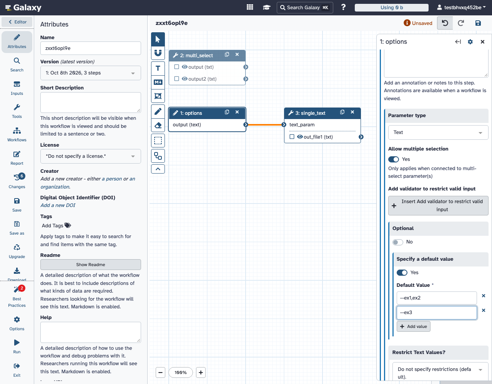
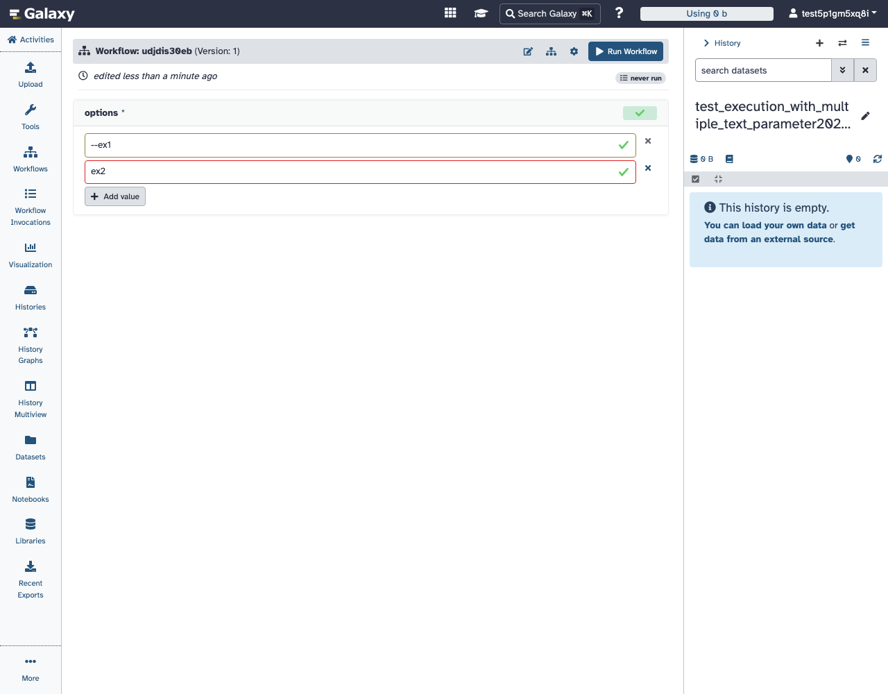

Implement 🎯 #21015 - multiple text workflow parameters work end to end, like multiple integers, so they can drive multi-select tool inputs.

#23802 made the editor accept the connection in #21015: a text input with "Allow multiple selection" feeding something like Bakta's "Select steps to skip". The workflow still couldn't be used:

| Multiple text input | `dev` | This PR |
| --- | --- | --- |
| Run form | One textarea, values typed one per line, no suggestions | One field per value (➕ to add a row), with the input's suggestions on every row |
| Value submitted | `"a\nb"`, a single string | `["a", "b"]` |
| Static multi-select tool input receives it | 🚫 `invalid option` (`"a\nb"` isn't one of its options) | ✅ `a` and `b` selected |
| A value containing a comma | Kept | ✅ Kept (`"--ex1,ex2"` stays one value) |
| Editor default | Single text field; a list default shows as the one string `['amrfinder', 'deepsig']` | ✅ One field per value; saved as a list and reloaded as rows |
| `restrictOnConnections` with a list default | Nothing preselected | ✅ Every default value preselected |

| List default in the editor | Run form |
| --- | --- |
|  |  |

Multiple integers use the same rows. While recording these screenshots, the rows got a small style fix: each remove × is now centered on its field, and rows are spaced further apart.

```yaml
inputs:
  steps_to_skip:
    type: string
    multiple: true   # "Allow multiple selection"
    default: [amrfinder, deepsig]
```

***This follows #23939's list-only design for multiple integers. Text and integers now share the same backend code, and the integer run form is the component this generalizes, so it isn't a second mechanism.***

***Unlike integers, multiple text parameters existed before. But on `dev` a newline-joined value reached a static multi-select as one invalid option, so rejecting it at the request replaces a later failure. No IWC workflow uses a multiple text parameter.***

***Tool text inputs and single-value text parameters still take one string. Only workflow parameters with `multiple` set take lists.*** Float parameters share the code, so `[float]` lists are converted to floats the same way.

<details><summary>Implementation</summary>

- **Backend (`basic.py`).** `TextToolParameter` takes over the multiple handling that #23939 added to `IntegerToolParameter`, which keeps only its int conversion:
  - entries must be non-empty text (numbers are converted) without newlines, and a bare string becomes a one-item list;
  - validators run per entry;
  - `from_json`, `to_json` and `get_initial_value` are list-aware.
  - `FloatToolParameter` gets the same conversion, because `run_request` now normalizes every multiple text-derived parameter.
- **Workflow module (`modules.py`, `workflow_parameter_input_definitions.py`).** The editor default for a multiple text parameter is a list field. A list default left behind after `multiple` is turned off reports "a single value is required". `restrict_options` preselects every value of a list default.
- **Client.** `FormNumberList` is generalized and renamed `FormValueList`. Text rows render `FormText` with per-row `datalist` ids and skip comma splitting. `FormElement` routes multiple integer, float and text inputs to it. Rows center their remove button and are spaced `mb-2`, up from `align-items-start mb-1`. The navigation selectors `*_number_list_*` become `*_value_list_*`; only the #23802/#23939 tests used them.

</details>

<details><summary>Tests</summary>

Each of these was red before its change:
- API `test_run_with_multiple_text_parameter`: a bare string is stored as a list.
- API `test_value_restriction_selects_multiple_text_list_default`: list default preselected.
- Unit `test_parameter_input_multiple_text_list_default`: the editor default field is multiple and round-trips a list.
- Unit `test_parameter_input_text_list_default_after_disabling_multiple`.
- `basic.py` doctests: per-entry checks, text `from_json` and initial value, float lists.
- Vitest: commas kept in text values; suggestions on every row.
- Selenium `test_multiple_text_parameter_connections`: connects a multiple text input to `multi_select`, sets a two-row default containing a comma, then saves and reloads it. It fails on the missing list rows when the editor default isn't multiple.

Selenium `test_execution_with_multiple_text_parameter` runs a workflow from the run form with a text list. `test_multiple_integer_parameter_with_range` sets min/max and a list default in the editor, then checks the saved range and the run form rows. `test_multiple_text_parameter_connections` and `test_execution_with_multiple_text_parameter` record the screenshots above. The existing multiple-integer and restricted-select E2E tests cover the renamed selectors. All the E2E tests pass locally under Playwright.

</details>

## Risks

Multiple text values are now lists only, so API callers and gxformat2 defaults that relied on a newline-joined string get an error instead.

<details><summary>Risk Details</summary>

- A multiple text value sent as one string containing newlines (`"a\nb"`) is rejected with "values cannot contain newlines; pass a list". On `dev` it passed validation and a multi-select with resolved options then rejected it. Rerunning a `dev` invocation that used the textarea sends such a string.
- Empty entries (`["a", ""]`) are rejected, and a required multiple text sent as `""` reports "at least one value is required".
- A saved default containing a newline fails the invocation at scheduling. The `dev` editor couldn't save a list default, so only hand-written gxformat2 or API-built workflows can have one. None of the 66 IWC workflows with text parameters marks one `multiple` (IWC snapshot 2026-09-08).
- A bare string is stored as `["s"]`. A downstream multi-select selects the same thing as before.
- `[float]` lists submitted through the run request are recorded as floats (`[1, 2]` → `[1.0, 2.0]`).
- "at least one integer is required" now reads "at least one value is required".
- A list default on a single-value parameter (left after unticking `multiple`) is an editor error, "a single value is required", for text as well as integers.

</details>

<details><summary>Risk Review Advice</summary>

Check the list-only rule matches what #23939 settled for integers, and that rejecting newline strings, rather than splitting them, is acceptable for API clients. The client rename is mechanical. The editor default field and `restrict_options` are the behavior changes to look at in the UI.

</details>

## Context

Builds on 🔀 #23802 (editor connection for multiple text inputs) and 🔀 #23939 (list-only multiple integers and the list run form). The issue thread also suggested an expression that splits one text value into options. A multiple parameter needs no extra step and matches the integer design, so this PR doesn't add one. Defaults and subworkflow inputs still reach steps without list normalization, as for integers on `dev`. That fix is shared with integers, so it's left for a follow-up.

## John's Checklist

- [x] Did a human read every test and every comment? (Requires human author to check)
- [x] What does the user see when it fails? The run request returns a 400 naming the input and the problem (and the value, for validator failures). The editor shows the error under the default field.
- [x] Is the diff free of unrelated or stale generated changes? Yes!
- [x] Are unit tests not just testing the literal implementation? Yes. They check stored and reloaded workflow state, run-form values and the selections a tool receives.
- [x] Are the comments free of excess archeology? Yes.
- [x] If comments contain some description of previous implementation, bugs, etc.. - what purpose do they serve? N/A
- [x] Which existing workflows change behavior (if any)? Only ones whose multiple text values or defaults are newline-joined strings (see Risks).
- [x] Who hits this in practice and what is the evidence? Anyone exposing a multi-select tool option as a workflow parameter. #21015 reports this with Bakta's "Select steps to skip".
- [x] Were simpler or existing approaches considered? Yes. Splitting newline strings on the backend was tried and dropped to match #23939's list-only integers. A split expression would add a step for each such input.

## How to test the changes?
- [x] I've included appropriate automated tests.
- [x] Instructions for manual testing are as follows:

<details><summary>Manual check</summary>

1. In the workflow editor, add a text input and tick "Allow multiple selection". Connect it to the `multi_select` test tool's `select_ex`, or to any tool's multi-select.
2. Tick "Set a default value" and enter two values, one containing a comma. Save, then reopen the input: both rows come back.
3. Run the workflow. Add or remove rows in the run form, then check the tool's job: each row is a separate selected option.

</details>

## License
- [x] I agree to license these and all my past contributions to the core galaxy codebase under the [MIT license](https://opensource.org/licenses/MIT).
