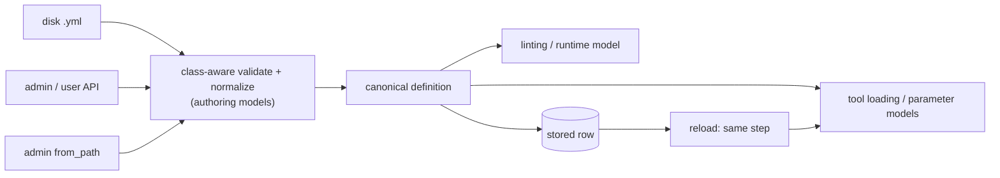

Title: YAML tools have two dialects: the authoring models accept definitions the tool loader misreads

_Posted by an AI assistant (Claude) on jmchilton's behalf — not personally authored._

Galaxy validates API-created YAML tools against Pydantic authoring models, but every YAML tool, disk or database, is loaded by a parser that speaks a different, older dialect, so valid definitions crash or silently change meaning.

| Definition | Authoring model (API / database tools) | Tool loader (`YamlToolSource` parser) | Result |
|---|---|---|---|
| `{type: boolean, value: true}` | ✅ accepted, documented | reads `checked`, ignores `value` | ❌ form shows unchecked, job runs with `false` |
| `{type: boolean, checked: true}` | ❌ `Extra inputs are not permitted` | ✅ the only way to default to true | no API-created tool (user or admin) can default a boolean to true; only disk files and admin `from_path` imports can |
| `{type: repeat, parameters: [...]}` | ✅ accepted | expects `blocks:` | ❌ `KeyError: 'blocks'` |
| `{type: section, parameters: [...]}` | ✅ accepted | not a grouping type | ❌ `UnknownParameterTypeError: ... section` |
| `GalaxyTool` output `{type: text}` (or `integer`, `float`, `boolean`) | ✅ accepted, documented as scalar outputs | only `data` and `collection` | ❌ `Unknown output_type [text] encountered.` |
| `{type: text}` (or multi-select) without `optional` | defaults to `optional: false` | infers `optional: true` when the key is absent | ❌ optional from disk or the admin API, required once created as a user tool (its full dump writes `optional: false`) |
| `GalaxyTool` dataset output with typo `format_souce` | silently dropped | — | the typo is lost without a warning (`GalaxyUserTool` rejects it) |
| `simple_constructs.yml` (in-tree fixture) | ❌ 8 errors: `checked`, `display`, `blocks`, `when`, untyped output, numeric `version` | ✅ loads | disk tools are written in a dialect the models reject |

The boolean row was reproduced end to end on `dev` (537915642fa) with a user-defined tool, and the rest at the model/parser boundary. The models aren't wrong in isolation, and neither is the parser. Nothing connects them: unit tests check the models' `to_internal()`, which the module docstring says "is not load-bearing for execution today". Production reads the dumped dict through `YamlToolSource` and the XML-oriented parameter factory. Every new model feature can drift the same way, and fixing these one at a time won't stop that.

<details><summary>Reproduce the boolean default (API test)</summary>

```python
BOOL_TOOL = {
    "id": "bool_default_true",
    "name": "Boolean default true",
    "class": "GalaxyUserTool",
    "container": "busybox",
    "version": "1.0.0",
    "shell_command": "echo '$(inputs.flag)' > out.txt",
    "inputs": [{"type": "boolean", "name": "flag", "value": True}],
    "outputs": [{"type": "data", "from_work_dir": "out.txt", "name": "out", "format": "txt"}],
}

tool = self.dataset_populator.create_unprivileged_tool(UserToolSource(**BOOL_TOOL))
build = self.dataset_populator.build_unprivileged_tool(UserToolSource(**BOOL_TOOL), history_id=history_id)
# flag "value" in the tool form: False
self.dataset_populator.run_tool_raw(None, {}, history_id, tool_uuid=tool["uuid"])
# output: 'false\n'
```

The parameter factory and `BooleanToolParameter` both go through `boolean_is_checked()` (`lib/galaxy/tool_util/parser/util.py`), which reads only `checked`.

</details>

<details><summary>Reproduce the model/parser mismatches (Python)</summary>

```python
from galaxy.tool_util.parameters import input_models_for_tool_source
from galaxy.tool_util.parser.yaml import YamlToolSource as Parser
from galaxy.tool_util_models import YamlToolSource
from galaxy.tool_util_models.yaml_parameters import YamlGalaxyToolParameter

for t in ("repeat", "section"):
    m = YamlGalaxyToolParameter.model_validate(
        {"name": "group", "type": t, "parameters": [{"name": "n", "type": "integer", "value": 1}]}
    )
    input_models_for_tool_source(Parser({"inputs": [m.model_dump(exclude_none=True)]}))
    # repeat: KeyError: 'blocks'; section: UnknownParameterTypeError

m = YamlGalaxyToolParameter.model_validate({"name": "flag", "type": "boolean", "value": True})
m.root.to_internal().value  # True
input_models_for_tool_source(Parser({"inputs": [m.model_dump(exclude_none=True)]})).parameters[0].value  # False

v = YamlToolSource.model_validate({
    "class": "GalaxyTool", "id": "scalar_out", "name": "scalar out", "version": "1.0",
    "container": "busybox", "shell_command": "echo", "outputs": [{"name": "out", "type": "text"}],
})
Parser(v.model_dump(by_alias=True, exclude_unset=True)).parse_outputs(None)
# ValueError: Unknown output_type [text] encountered.
```

For optionality: load `test/functional/tools/configfile_user_defined.yml` or `parameters/gx_select_multiple_one_default_user.yml` with the parser directly, and again after `UserToolSource.model_validate(raw).model_dump(by_alias=True)` (what `create_unprivileged_tool` stores). The first parameter's `optional` goes from `True` to `False`. With `model_dump(by_alias=True, exclude_unset=True)` (the admin API policy) it stays `True`.

</details>

<details><summary>In-tree YAML fixtures checked against the authoring models</summary>

All 24 `.yml` tools under `test/functional/tools/` (15 `GalaxyTool`, 9 `GalaxyUserTool`) were validated against the matching model. 22 pass.

- `simple_constructs.yml`: numeric `version`, boolean `checked`, select `display` (×2), repeat `blocks`, conditional `when` instead of `whens`, dataset output without `type`.
- `collection_creates_pair_y.yml`: numeric `version`, static collection `elements`.

`lib/galaxy_test/base/data/minimal_tool_no_id.json`, imported by `test_dynamic_tool_from_path`, uses a Cheetah `command` and no `shell_command`. Admin `from_path` creation loads raw files without model validation.

</details>

<details><summary>Where YAML tool dicts reach the parser</summary>

Each site gets a differently shaped dict, and most get no validation:

| Site | Dict it parses |
|---|---|
| `get_tool_source` (`tool_util/parser/factory.py`) | disk file, `ordered_load`, unvalidated |
| `build_yaml_tool_source` (same file) | stored raw source, `safe_load`, unvalidated |
| `DynamicToolManager.create_tool` (`managers/tools.py`) | admin representation `model_dump(by_alias=True, exclude_unset=True)`, or a raw `from_path` file, unvalidated |
| `create_unprivileged_tool` (`managers/tools.py`) | user representation, full `model_dump(by_alias=True)` |
| `dynamic_tool_to_tool` (`tools/__init__.py`) | stored row; `GalaxyUserTool` rows revalidated by `lift_user_tool_source` then fully dumped, `GalaxyTool` rows unvalidated |
| `tool_payload_to_tool` / runtime-model endpoint (`api/dynamic_tools.py`) | full `model_dump(by_alias=True)` |
| `lint_user_tool_source` (`tool_util/lint.py`) | `model_dump(by_alias=True, exclude_none=True)` |

Three dump policies decide which defaults the parser sees. `lift_user_tool_source` revalidates stored user tools before loading, but its output still goes through the same parser, so it can't fix any row in the table.

</details>

## Context

Found while documenting tool parameter references in 🔀 #23877, which currently describes the YAML file format as its own flavor. Related to 🎯 #23444, which needs one loading boundary before its reference validation can mean the same thing everywhere, and to 🎯 #23380, collection output field parity for user-defined tools (collection outputs are now strict, `inherit_format`/`inherit_metadata` still worth re-checking). 🎯 #22758 closed the same kind of split for collection outputs (`structure:` vs flat); this issue is the general version.

## Proposed Approach

Make the authoring models the single canonical YAML representation for each tool class, and route every path that builds a YAML tool (disk, stored rows, admin and user creation, `from_path`, linting, runtime model) through one class-aware validate-and-normalize step. First fix the model→loader mismatches above, then convert the in-tree fixtures to the canonical spelling rather than keeping the old dialect as a second public syntax. Keep the `GalaxyTool`/`GalaxyUserTool` trust differences as they are.

<details><summary>Proposed Approach In Detail</summary>

### Target shape



### Slices (each a reviewable PR)

1. **Regression matrix first.** Each fixture goes through the authoring model, dump, parser and tool loading, and the test asserts groupings, boolean defaults, omitted vs `null` vs explicit values, output types and unknown output keys. Write these red.
2. **Repair model→loader semantics.** Repeats with `parameters:`, sections, booleans with `value`, one explicit optionality default policy. Consider a model-backed `InputSource` adapter so the parser can't read the dict differently from `to_internal()`. Not every `YamlInputSource` should be validated as a full tool, because workflow parameter inputs use it too.
3. **Convert in-tree fixtures.** `simple_constructs.yml`, `collection_creates_pair_y.yml` and the raw `.json` path-import fixtures move to canonical spelling, and their runtime assertions stay. Check whether static collection `elements` actually works before preserving it.
4. **One construction path.** Route disk, the raw-source factory, admin creation and `from_path`, payload loading and new writes through the validate-and-normalize step. Decide separately how to read existing stored rows.
5. **Strict authoring.** Reject unknown fields on admin dataset outputs, as user dataset outputs and all collection outputs already do. Either make scalar outputs (`text`/`integer`/`float`/`boolean`) loadable or stop advertising them.
6. **Prove parity.** Execute one definition from disk, through admin creation, `from_path`, persisted reload and (where allowed) user creation, and compare the outputs. Update the authoring docs, the generated schema and #23877.

### Stored rows and job snapshots

Converting in-tree fixtures is safe, but it doesn't cover stored user tools, rerun reproducibility or historical raw-source snapshots. Stored user tools already pass through `lift_user_tool_source` on load, which drops schema-rejected fields with a warning; stored `GalaxyTool` rows get nothing. Inventory what is actually persisted. If legacy shapes need reading, grow that lift into one historical-read adapter for both classes that emits the canonical form with visible diagnostics. Don't accept legacy shapes for new authoring.

### Out of scope

Tool profile gates (this is a representation fix, not new runtime behavior), XML/CWL loading, and widening what `GalaxyUserTool` may do.

</details>

## Alternative Approaches

The alternatives either make the two dialects permanent or fix today's symptoms without stopping the next mismatch. A single validated representation is the only option where "the model accepted it" means "the tool behaves that way".

<details><summary>Alternatives In Detail</summary>

### Alternative: Teach the parser both spellings

<details><summary>Description</summary>

#### Details

Accept `value` and `checked`, `parameters` and `blocks`, `whens` and `when`, and register `section` in the parser. That is the smallest change, and every row in the table works.

#### Why the proposed approach is preferred

It makes two spellings permanent, and every later feature has to be added to both. Optionality and dump-policy differences remain, because they come from defaults, not spellings. Nothing stops the next model field from drifting.

</details>

### Alternative: Validate only at the API boundary

<details><summary>Description</summary>

#### Details

Run disk YAML tools through the authoring models as a lint step or at load time, and leave the parser alone.

#### Why the proposed approach is preferred

Validation doesn't fix interpretation. The boolean, repeat, section and scalar-output rows all pass validation and then fail or misbehave in the parser. The fixes still have to happen at the loading boundary.

</details>

### Alternative: File and fix each mismatch independently

<details><summary>Description</summary>

#### Details

Treat grouping loading, boolean defaults, scalar outputs, optionality and output strictness as unrelated bugs.

#### Why the proposed approach is preferred

They're worth landing as separate PRs (the slices above), but without a shared construction path and the cross-boundary regression matrix, each fix is a one-off patch and the gap reopens with the next model change.

</details>

</details>
