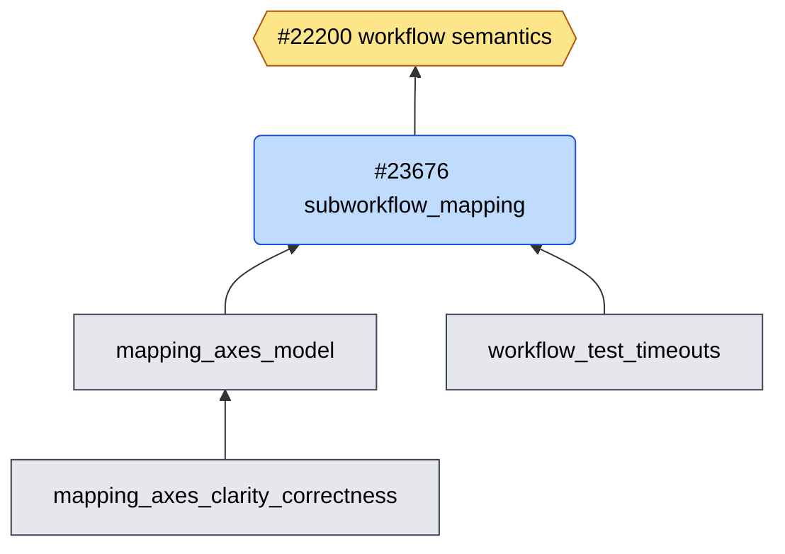
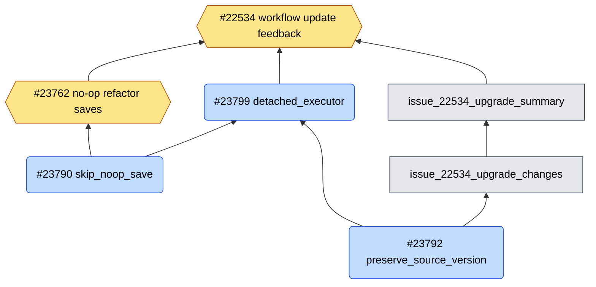
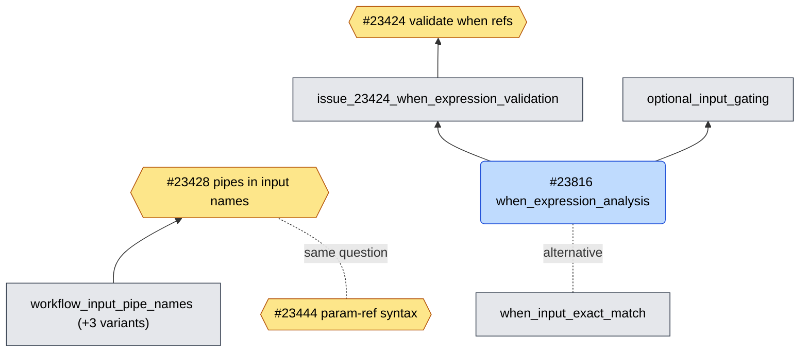
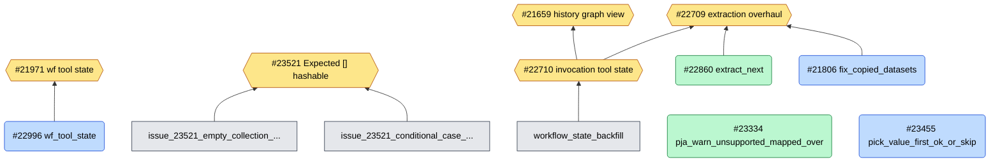

# Workflow work graph

Last updated 2026-09-30. Arrows point toward what the work serves: branch → PR → issue.

Work item types:

- **Issue**: what the work serves.
- **Ready PR**: open and out of draft.
- **Draft PR**: open, still a draft.
- **No PR**: a branch with no open PR.

## Blockers at a glance

| Item                                         | Type                  | Blocked by                                                              |
| -------------------------------------------- | --------------------- | ----------------------------------------------------------------------- |
| `mapping_axes_model`                         | No PR                 | Not yet intelligible; needs a clarity pass before it can be a PR        |
| #23676 `subworkflow_mapping`                 | Draft PR              | `mapping_axes_model` landing below it                                   |
| #23799 `workflow_refactor_detached_executor` | Draft PR              | #23790 and #23792                                                       |
| `issue_22534_upgrade_changes`                | No PR                 | #23792 (it carries its own copy of that fix)                            |
| `issue_22534_upgrade_summary`                | No PR                 | `issue_22534_upgrade_changes`                                           |
| #23816 `when_expression_analysis`            | Draft PR              | Derailed in review; response drafted in `gx_branches/23816_response.md` |
| `issue_23424_when_expression_validation`     | No PR (#23817 closed) | #23816                                                                  |
| `optional_input_gating`                      | No PR                 | #23816                                                                  |
| `workflow_input_pipe_names` (+ 3 variants)   | No PR                 | Choosing a scope; validation-only recommended                           |
| #23444                                       | Issue                 | John answering mvdbeek's two questions                                  |

## 1. Subworkflow mapping semantics → #22200

The goal is to model collection mapping as ordered axes, so mapping behaves the same in the
editor and the backend, including across subworkflow boundaries. The axes model is the
foundation, and it has to land as its own reviewable PR before #23676 makes sense.

- **#22200** Workflow semantics docs + test mapping (issue)
  - **#23676** `subworkflow_mapping` (draft PR): brings subworkflow mapping inline between editor and backend
    - blocked by `mapping_axes_model`
    - **`mapping_axes_model`** (no PR): the ordered-axes model of collection mapping; goes below #23676
      - blocked by: not intelligible yet
      - **`mapping_axes_clarity_correctness`** (no PR): correctness fixes stacked on `mapping_axes_model`
    - **`workflow_test_timeouts`** (no PR): lets slow workflow tests set a timeout; folded into #23676 but separable
  - related: **#23521** conditional subworkflows fail with `Expected [] to be hashable` (same code paths)

## 2. Refactor API fixes → #22534

The refactor/upgrade API has to stop saving new versions for no-op refactors and stop
rewriting old versions in place. Only then can it report what an upgrade changed, which is
what #22534 asks for.

- **#22534** Feedback on potential workflow updates (issue)
  - **#23762** Refactor saves a new version even when nothing changed (issue, split off from #22534)
    - **#23790** `workflow_refactor_skip_noop_save` (draft PR): land first
  - **#23792** `workflow_refactor_preserve_source_version` (draft PR, targets 26.1): land first
  - **#23799** `workflow_refactor_detached_executor` (draft PR): merges #23790 and #23792 forward to dev
    - blocked by #23790 and #23792
  - **`issue_22534_upgrade_changes`** (no PR): reports tool and subworkflow version changes from upgrades
    - blocked by #23792; probably rebase onto #23799 once that lands
    - **`issue_22534_upgrade_summary`** (no PR): shows the upgrade summary in the editor

## 3. Pipes in names and `when` expressions → #23424, #23428

Two tracks deal with pipe-delimited paths. `when` expressions should reference inputs by
structured path and be validated at import (#23424). Workflow input names probably shouldn't
contain pipes at all (#23428). #23816 is the root of the `when` track, and it stalled in review.

- **#23424** Validate `when` input references at import (issue)
  - **`issue_23424_when_expression_validation`** (no PR; #23817 closed until unblocked)
    - blocked by #23816
    - **#23816** `when_expression_analysis` (draft PR): match `when` inputs by path, not substring
      - blocked by: derailed in review
      - **`optional_input_gating`** (no PR): run steps only when an optional input is present; stacked on #23816
      - **`when_input_exact_match`** (no PR): smaller whole-name alternative to #23816; one or the other
- **#23428** Should pipes be allowed in subworkflow input names? (issue)
  - **`workflow_input_pipe_names`** (no PR): original branch, plus comparison variants `_validation`, `_top_level` and `_nested`
    - blocked by: choosing a scope (validation-only recommended)
- **#23444** Canonical nested parameter-reference syntax (issue): same path-syntax question on the tool side
  - blocked by: John answering mvdbeek

## 4. Adjacent workflow work

This work doesn't belong to the three tracks above, but it touches the same code.

- **#22709** Workflow extraction overhaul (issue, meta)
  - **#22860** `extract_next` (ready PR, approved)
  - **#21806** `fix_copied_datasets` (draft PR)
- **#22710** Invocations don't capture tool request state (issue), which serves #21659 and #22709
  - **`workflow_state_backfill`** (no PR): failed attempt, kept as evidence only
- **#21971** Schema-aware workflow tool state (issue)
  - **#22996** `wf_tool_state` (draft PR)
- **#23521** `Expected [] to be hashable` (issue)
  - **`issue_23521_empty_collection_single_data_param`** (no PR): description ready
  - **`issue_23521_conditional_case_resolution`** (no PR): blocked by an unproven runtime path
- Pick-value work, no issue:
  - **#23334** `pja_warn_unsupported_mapped_over` (ready PR)
  - **#23455** `pick_value_first_ok_or_skip` (draft PR)

## Open questions

- Is `mapping_axes_clarity_correctness` part of making `mapping_axes_model` intelligible (fold it in), or does it stack above?
	- Has #23676 superseded `subworkflow_mapping_when_alignment`? It's left off the graph until confirmed.
- `wf_refactor_persistence` (March): abandon it? It's left off the graph.
- Is `when_input_exact_match` a way to unblock #23424 while #23816 is stalled?
