# Galaxy Notebooks: Reproducible Communication for Data-Intensive Analysis

## Abstract

Galaxy histories capture the computational record of an analysis—datasets, tools, parameters, metadata, and provenance—but not the communicative record: why choices were made, which outputs matter, and how results should be interpreted. We introduce **Galaxy Notebooks**, history-attached Galaxy-flavored markdown documents that persist alongside datasets and tool runs, embed Galaxy artifacts directly into narrative text, and record human and agent-authored revisions with provenance. A Galaxy Notebook can be written by a researcher, co-authored with the in-app AI assistant, or authored by an external agent through Galaxy's API and Model Context Protocol (MCP) server; in each case the narrative remains reviewable, shareable, and attributable inside the history context, and agent edits are recorded as attributable agent revisions. Galaxy Notebooks also turn documented outputs into reuse: notebook-referenced artifacts seed graph-backed workflow extraction, keeping the documented analysis, its provenance structure, and the resulting workflow report connected. We demonstrate this on three real comparative-genomics and epigenomics analyses. In the cleanest case, backward extraction from a four-isolate mobile-resistome notebook recovers a fourteen-step, sample-agnostic workflow that re-runs byte-identical to the validated original. A richer differential-accessibility notebook extracts into a thirteen-step workflow that ranks condition-gained regions, recovers expected lineage master regulators, and re-runs to identical results. A harder differential-ChIP notebook exposes the boundary: an irreducible two-way comparison extracts faithfully but condition-pinned, then resolves into reusable caller and comparator workflows. All three documented notebooks were themselves authored by an external agent driving Galaxy's MCP, exercising attributable agent authorship end to end. The implementation reuses Galaxy's existing Page model, editor, API, revision system, and markdown renderer, adding history context, history-aware assistant tools, and history-panel entry points. Galaxy Notebooks reposition documentation as part of the reproducibility surface: not a post hoc supplement to computation, but a durable interface between histories, workflows, and scientific interpretation.

## Introduction

Reproducible bioinformatics has usually been framed around computation. A published analysis should identify its inputs, software, parameters, workflow, and execution environment well enough that another researcher can inspect or re-run it [Goecks 2010; Sandve 2013; Abueg 2024]. Galaxy was built around this premise. A Galaxy history records the datasets produced during an analysis, the tools that produced them, the parameters used for each job, and the provenance links among those jobs. A Galaxy workflow turns a successful analysis pattern into a reusable graph. These are strong answers to the question "what happened?"

They are weaker answers to the question "what did it mean?" A history can show that a user trimmed reads, mapped them, filtered alignments, and generated a table. It cannot reliably show why one branch was abandoned, which plots were persuasive, which parameters were chosen for biological rather than mechanical reasons, or which outputs belong in the final report. Some of this context may live in dataset annotations, a lab notebook, a paper draft, a chat transcript, or the memory of the analyst. None of those places is the history itself.

This gap matters even more as AI agents become capable of driving scientific software. An agent can call tools, inspect outputs, iterate through failed attempts, and produce plausible summaries. If the only durable record of that work is the final set of datasets, or a chat transcript disconnected from the data, then automation increases the volume of analyses faster than it increases trust in them. The failure mode is not that agents write too much text. The failure mode is that agents produce computational artifacts without a durable, inspectable, versioned account of why those artifacts exist and how they should be interpreted.

Computational notebooks have long offered one answer: put prose, code, and output in the same document [Knuth 1984; Kluyver 2016; Rule 2019]. That model is valuable, but it is not the model Galaxy needs to copy. Computational notebook studies also show that ordinary notebook artifacts can be difficult to re-run and maintain without strong discipline [Pimentel 2019; Samuel 2024]. Galaxy already has an execution system with explicit tool definitions, saved parameters, datasets, histories, workflows, permissions, and provenance. Recreating execution inside a notebook would weaken the distinction Galaxy has spent years making clear. The missing piece is not a new execution substrate; it is a narrative substrate coupled to the existing one.

Galaxy Notebooks provide that substrate. A Galaxy Notebook is a Galaxy-flavored markdown document attached to a history. It can describe the analysis as it unfolds, embed datasets and collections from the history, show rendered Galaxy components in preview, and persist as part of the same shareable analysis context. Every save creates an immutable revision. Each revision records whether its content came from a user, an AI assistant, or a restore operation. A notebook can be written entirely by a human, co-authored with the in-app assistant, or updated by an external agent through the same API.

The central claim of this paper is that Galaxy Notebooks make the communication of an analysis reproducible. They do this by treating narrative, selected outputs, provenance references, and report content as first-class analysis artifacts. The notebook is not an after-the-fact note and not merely a chat window. It is the document that connects the history a researcher produced, the explanation a reader needs, and the workflow a future user may re-run. We substantiate the reuse half of that claim with three worked vignettes drawn from real analyses, chosen to expose both the happy path and its boundaries.

The remainder of the paper is organized as follows. We first describe the design goals behind Galaxy Notebooks and the terminology used throughout the system. We then describe the user model: human authoring, human-assistant co-authoring, and external agent authoring. We next describe notebook-driven workflow extraction, grounded in three worked vignettes that report what the path delivers and where it stops. We then summarize the implementation, including the unified Page model, revision and chat persistence, frontend architecture, API surface, and test coverage. We close with a discussion of related work and limits.

## Design Goals

Galaxy Notebooks were designed around five goals.

**Preserve narrative next to computation.** A notebook should live where the analysis lives. Users should not have to export screenshots to a separate document or copy dataset identifiers into an external lab notebook. The history is the computational container; the notebook is the narrative layer attached to it.

**Reference artifacts, not just describe them.** Markdown prose alone is insufficient. The notebook must be able to embed or refer to Galaxy datasets, collections, visualizations, and job-derived displays using Galaxy's existing markdown directive machinery. These references are what let a document remain connected to the concrete objects it discusses. Because the referenced outputs are real on-graph tool results, the parameter choices that produced them remain auditable. In one of our vignettes, a single tool default — an insertion-sequence scanner's `remove_short_is` flag — silently altered a result figure (25 versus 17 mobile-element calls for one isolate, producing spurious zero-distance overlaps); because the figure was an on-graph tool output rather than a pasted image, the discrepancy was traceable through provenance and corrected. A reference embeds an artifact that can be inspected, not merely a picture of one.

**Separate execution from explanation.** Galaxy histories and workflows remain responsible for computation. Galaxy Notebooks document and communicate that computation. This separation matters for reproducibility, review, and regulated settings: the prose may change as interpretation improves, but the computational provenance remains inspectable through the history.

**Make authorship attributable.** Human and agent contributions should not collapse into an undifferentiated document. Every saved revision is append-only and records an `edit_source`: user, agent, or restore. This is a modest but important provenance signal. It lets reviewers distinguish manual writing from accepted agent proposals without treating either as outside the record. It is provenance, not quality control: it records who or what wrote a passage, not whether the passage is correct.

**Let narrative seed reuse.** A documented history is often the best available description of what should become a reusable workflow. The notebook identifies outputs that matter and records the interpretive structure around them. Workflow extraction uses those references, together with the history provenance graph, to recover a workflow and seed its report.

These goals distinguish Galaxy Notebooks from two adjacent ideas. They are not standalone Reports: Reports use the same editor and model, but they are not attached to a history and do not inherit history-aware assistant tools. They are also not executable notebooks in the Jupyter sense: execution remains in Galaxy tools, histories, and workflows, while the notebook captures narrative and artifact references.

## System Concept

A Galaxy Notebook is implemented as a history-attached Galaxy Page. The backend distinction is deliberately small: `Page.history_id` is nullable. When set, the Page is a Galaxy Notebook; when null, the Page is a standalone Report. This implementation detail should not dominate the user-facing vocabulary, but it is central to the architecture. One model, one API surface, one editor, one revision system, and one markdown rendering pipeline serve both contexts.

The contexts differ in what surrounds the document. A Report is reached from the Reports grid or a direct editor URL. It has publishing and permissions controls and can be viewed through a slug-based published route. A Galaxy Notebook is reached through the history panel and inherits the history context. It can use history-aware assistant tools, drag datasets and collections from the history panel into the editor, and open in Galaxy's window manager as part of the history workspace.

This distinction keeps the product vocabulary precise:

- **Galaxy Notebook**: a history-attached document, user-facing.
- **Report**: a standalone document, user-facing.
- **Page**: the shared backend model and API implementation.
- **History Notebook**: older project language, avoided in the manuscript except when discussing prior drafts.

The notebook content is Galaxy-flavored markdown. In edit mode, users work with raw markdown and Galaxy directives. In preview or display mode, the API returns render-ready content with internal identifiers encoded in the form expected by existing Galaxy markdown components. The API also returns `content_editor`, the raw content that should be placed back into the editor. This dual-field pattern avoids the fragile round-trip that would occur if every edit cycle encoded and decoded directive identifiers.

## Authoring Modes

Galaxy Notebooks support three authoring modes through the same artifact.

### Human Authoring

The first mode is ordinary documentation. A researcher opens a history, clicks the Galaxy Notebooks entry point, and creates or selects a notebook associated with that history. The notebook can be titled, edited, previewed, saved, and reopened. The editor supports Galaxy markdown directives and drag-and-drop from the history panel. Dragging a dataset inserts the appropriate dataset display directive; dragging a collection inserts a collection display directive. The user can save a methods note, embed intermediate outputs, record why a parameter choice was made, or mark the result that should anchor a downstream workflow.

This mode matters on its own, independent of any AI capability. Galaxy has long supported histories, workflows, annotations, and Pages, but it has not provided a coherent history-attached document where narrative and embedded analysis artifacts persist together. A user who never opens the chat panel still receives the central benefit: the history now has a durable communication layer.

### Human-Assistant Co-Authoring

The second mode adds the in-app AI assistant. When a notebook is attached to a history, the assistant can inspect the history through constrained tools: list datasets, retrieve dataset metadata, read dataset peeks, inspect collection structure, and resolve user-visible history identifiers into the directive arguments needed by Galaxy markdown. The assistant receives the current notebook content as context and can return a conversational response, a full-document replacement, or a section-level patch.

Section-level patches are the most important authoring form. A user might ask the assistant to "summarize this history and draft a Methods section." The assistant can inspect the history and propose a replacement for `## Methods`. The frontend shows the proposed change as a diff that the user can accept or reject. If the user accepts it, the notebook content is saved as a new revision with `edit_source="agent"`. The assistant does not silently rewrite the document; it proposes changes that enter the notebook only through a reviewable save path.

This design treats AI as a co-authoring path, not as the object being published. The artifact remains the notebook, and the notebook's revision history records which content came from an agent.

### External Agent Authoring

The third mode is API-level authoring by external agents. Any agent that can call Galaxy APIs can create or update a notebook through the same Page endpoints used by the web client. This matters because agent-assisted science will not be confined to one chat panel. A command-line agent, a continuous-integration worker, or a domain-specific automation service may drive a Galaxy analysis through APIs and document its work as it goes.

In this mode, the notebook becomes the agent's structured output artifact. It is richer than a final chat answer because it embeds references to actual Galaxy objects. It is more durable than a chat transcript because it is saved as revisions on a Page. It is more reviewable than an unstructured log because a human can open it in Galaxy, inspect the history alongside it, compare revisions, and decide what to keep.

The same authorship rule applies: accepted content is revisioned and attributable. A future audit should be able to ask not only "which tool produced this dataset?" but also "who or what wrote this interpretation?"

Galaxy implements this path directly. Galaxy's Model Context Protocol (MCP) server [Anthropic 2024] exposes the notebook Page operations — list, read, create, update, revision listing, revision read, and revert — as agent-callable tools, backed by the same operations layer that serves the in-app assistant and the web client. An external agent reads a notebook's editable content (`content_editor`, with directive identifiers in encoded form), proposes new content, and writes it back; each content edit creates a revision recorded as `edit_source="agent"`, and a rollback is recorded as `edit_source="restore"`. The dual `content`/`content_editor` representation is what makes the round-trip safe: the agent edits the same raw markdown a human would, and embedded artifact directives survive the cycle. The three documented analyses in this paper were authored through this MCP rather than typed by hand — concrete evidence that the notebook is a usable, attributable output medium for external agents, not only for the in-app assistant.

## Notebook-Driven Workflow Extraction

Galaxy already supports extracting workflows from histories. The traditional extraction interface asks the user to select jobs or outputs from a history-oriented view and then constructs a workflow from the selected provenance. That mechanism is powerful, but the selection surface is not the same surface where the analyst explains the analysis. The user decides what mattered in one place and writes why it mattered somewhere else.

Galaxy Notebooks suggest a tighter path. A documented history contains explicit artifact references: the dataset displayed in the results section, the collection summarized in the methods, the visualization embedded in the interpretation. These references are not natural-language guesses. They are structured Galaxy markdown directives tied to concrete history artifacts. Given those anchors, Galaxy can walk backward through the history provenance graph to recover the computational closure needed to produce them.

A reference seeds extraction only if it points at an output the history actually produced. Because notebook directives reference concrete history artifacts — the dataset displayed in the results section, the collection summarized in the methods, the figure embedded in the interpretation — Galaxy can walk backward from those anchors through the provenance graph and recover the jobs, collections, and inputs that produced them. The discipline this rewards is simple and worth stating once: every figure or table a notebook displays should be a genuine on-graph tool output rather than a re-rendered copy, because the most reproducible way to document a result is also what lets its workflow be recovered. The differential-accessibility vignette below makes the payoff concrete — a notebook of DESeq2 and volcano-plot figures extracts its entire pipeline because each figure it shows is a real tool output.

The flow has three steps. First, the notebook identifies outputs that matter through embedded artifact references or an explicit saved selection. Second, Galaxy walks backward through the history graph from those artifacts, recovering the jobs, collections, and inputs required to reproduce them. Third, Galaxy extracts a reusable workflow and seeds its workflow report from the notebook narrative. The results reported here were produced by this page-based extraction directly from the notebook's referenced artifacts; a read-only, selectable graph view for confirming or pruning the recovered closure before extraction is a natural human-in-the-loop addition to this path.

This is deliberately not free-text workflow synthesis. The notebook prose provides explanation; the artifact references and graph provide precision. The user stays in control by curating which artifacts the notebook references and by editing the extracted workflow in the existing Workflow Editor; a graph confirmation view would add an explicit selection-and-confirmation surface before extraction, not a second workflow editor.

### Three Worked Vignettes

We exercised this path on three real analyses, ordered to make the claim and its limits visible. The first is the clean baseline: a comparative mobile-resistome notebook that extracts to a single sample-agnostic workflow and re-runs byte-identical to the original. The second is a richer differential-accessibility notebook whose visible figures and ranked tables become the workflow's outputs. The third is the boundary case: a differential-ChIP notebook that reproduces faithfully as a condition-pinned workflow, then becomes reusable when split into caller and comparator workflows. Table 1 summarizes the structural outcome of each.

**Table 1. Notebook-driven extraction across three vignettes.** Step counts include the input node(s) and all recovered tool steps. "Map-over steps" counts tool steps that ran as collection map-overs. "Exposed outputs" counts workflow outputs surfaced by the extraction. "Dangling" counts unresolved input connections in the extracted workflow. "Report warnings" counts leftover dataset-instance identifiers requiring manual repair in the seeded report. "Science-identical" indicates whether re-running the extracted workflow reproduced the original results. Vignette 3 contributes two rows — a single condition-pinned workflow and its split into reusable parts. An em-dash (—) marks a metric that does not apply to a given row.

| Vignette | Steps | Map-over steps | Exposed outputs | Dangling | Report warnings | Science-identical |
|---|---|---|---|---|---|---|
| Vignette 1 — mobile resistome (single workflow) | 14 | 8 | 9 | 0 | 0 | byte-identical |
| Vignette 2 — differential ATAC-seq (count matrix → ranked peaks) | 13 | — | 6 | 0 | 0 | reproduced |
| Vignette 3 — differential ChIP (single workflow) | 34 | — | 3 | 0 | — | reproduced, condition-pinned |
| Vignette 3 — differential ChIP (split: caller / comparator) | 5 / 29 | — | — / 3 | 0 / 0 | — | reproduced, sample-agnostic caller |

#### Vignette 1: A clean, byte-identical baseline

We validated the path on a real comparative-genomics analysis: a four-isolate *Staphylococcus aureus* mobile-resistome study (BioProject PRJDB8599). The biological question was comparative rather than single-sample: which resistance genes sit in mobile genomic contexts, and do related isolates carry the same resistance gene through the same mobile route? The notebook's result tables and heatmaps show the load-bearing answer. The aminoglycoside-resistance gene `aac(6')-aph(2'')` is IS6-adjacent on the plasmids of KUN1163 and KUH140046, but IS256-adjacent on the KUH180129 chromosome — the same resistance gene appearing in different mobilizing-element contexts.

The history was documented as a Galaxy Notebook in which every analytical step — antimicrobial-resistance gene detection, insertion-sequence scanning, integron finding, coordinate reformatting, and ARG-to-IS distance computation — ran as a collection map-over across the four isolates, and both result figures were on-graph tool outputs rather than pasted images. Backward extraction from the notebook's referenced artifacts recovered a fourteen-step workflow (one input collection plus thirteen tool steps), with every input connection resolved (zero dangling), nine workflow outputs, eight collection map-over steps, and a seeded workflow report requiring no manual repair (zero leftover dataset-instance identifiers). The recovered workflow is sample-agnostic.

The extracted workflow reproduces the original exactly. Re-running it produced an ARG-to-IS distance collection byte-identical to the validated original across all four isolates, with both figure matrices byte-identical as well (one differing only in cosmetic row order). Extraction recovers the same computation, not an approximate reconstruction — the concrete payoff of grounding reuse in the provenance graph rather than in free-text synthesis.

Two conditions scope this result. First, these numbers come from a notebook deliberately structured for extractability — consistent collection map-over, on-graph figures throughout — and should be read as design guidance, not as a promise that any arbitrary history extracts this cleanly. Achieving them required documenting the result matrices as on-graph tool outputs rather than pasted Python output — the same discipline Vignette 2 isolates. Second, the extractable core operates at the insertion-sequence-family level; richer per-genome annotation (here, Bakta) is optional enrichment outside the fourteen-step workflow, not part of the extracted graph.

#### Vignette 2: A differential-accessibility application, documented and extracted

The second vignette carries the same notebook-to-workflow pattern into a larger differential-analysis application. It asks which chromatin regions change accessibility between two human blood lineages — **erythroblasts versus B-cells** — using the Corces 2016 hematopoiesis ATAC-seq atlas (GEO GSE74912, hg19), a genome-wide matrix of read counts over **590,650 reproducible peaks** across 132 samples. We contrast eight samples, four per lineage with donors as replicates, taking the precomputed matrix as the input boundary rather than reprocessing raw reads.

The analysis was assembled interactively through the MCP as an ad-hoc pipeline of real Galaxy tools. Per-sample counts uploaded as a single **list collection**, plus a sample sheet, feed **DESeq2** (`~ condition`, Erythroblast as reference); the result table is NA-filtered and then branches two ways — into a **volcano plot** of the full testable cloud, and into a **significance filter** (padj < 0.05, |log2FC| ≥ 1) that is **sorted by fold change** and sliced into the **top condition-gained and condition-lost** peak tables. Every figure the notebook displays is a genuine on-graph tool output: the DESeq2 PCA and the volcano plot as image outputs, and the result, significance, and ranked tables as tabular outputs (Figure 3a).

The science is clean and biologically legible. PC1 captures ≈ 98% of the variance and separates the lineages; **45,620 of ~247,038 testable peaks are significant** (34,873 B-cell-gained, 10,747 erythroblast-gained). The ranked tables recover the lineage master regulators on the correct sides — erythroid **GATA1** (chrX, log2FC ≈ −5.9) and **HBB** (≈ −6.6) gained in erythroblasts; **EBF1**, **PAX5**, **MS4A1/CD20** (≈ +7.3), and **CD19** gained in B-cells — the GATA1↔EBF1/PAX5 axis that defines the erythroid–lymphoid switch.

Backward extraction from the notebook's referenced outputs recovers a **thirteen-step workflow** — counts collection and sample sheet → DESeq2 → NA-filter → { volcano ∥ significance-filter → sort → top-gained / top-lost }, plus the two image-output branches that produce the PCA and volcano figures — with every input connection resolved (zero dangling), six exposed outputs, and a seeded report requiring no manual repair. Passing only the count collection as the workflow input (not its eight element datasets) keeps the input surface clean; because the counts collection and sample sheet are the workflow's inputs, a larger or fresh cohort of the same contrast re-runs without edits (a different contrast means a new sample sheet and updated reference/target levels). Re-running it reproduces the analysis exactly — the same 590,650-peak universe, the same 45,620 significant peaks with the identical 34,873 / 10,747 split, and the same master-regulator loci. The result is not just the DESeq2 test reproduced but the *answer* made reusable: the significant peaks and the top condition-gained regions are workflow outputs that can be sorted, counted, and fed onward, not dots in a figure.

#### Vignette 3: An irreducible limit, resolved by splitting

The third vignette keeps the biological framing but makes the boundary of one-workflow reuse explicit. It identifies TAL1 transcription-factor binding sites that differ between two blood-cell lineages (erythroid G1E versus megakaryocyte, mm10, MACS2 peak calling). The notebook's result tables and distance-to-TSS heatmap recover the expected lineage pattern: G1E 261 peaks / megakaryocyte 150 peaks; common 39, G1E-only 222, mega-only 110; promoter-bound hits include *Gata1* in the G1E-only set, *Fli1* with *Tal1* in the megakaryocyte-only set, and *Cbfa2t3* (ETO2) in the common set.

The analysis was deliberately rebuilt so the notebook results were graph outputs rather than copied side products. Reads were encoded as nested `list:list` collections (outer level = condition, inner level = replicate), driving Bowtie2 alignment map-over and a single MACS2 step that maps over conditions while pooling replicates. Candidate-gene lists were produced with Galaxy's grouping tool, and the distance-to-TSS figure was built from bedtools, text-processing, Datamash, Multi-Join, and `ggplot2_heatmap2`. In other words, the notebook reports a biological contrast from a clean all-tool graph.

The remaining obstacle is topological. A differential two-condition comparison selects two specific named elements — one per condition — out of a peak collection and compares them. A collection-element selection feeding a single-dataset tool input has no representation as a sample-agnostic workflow edge, so this seam cannot be made generic inside one extracted workflow. Extracted as a single workflow, the notebook therefore produces a complete but condition-pinned graph: thirty-four steps, zero dangling inputs, three outputs, with the comparison seam pinned to `identifier=G1E` and `mega`. It re-executes and reproduces the analysis faithfully, but reuse on new conditions means editing the seam.

Galaxy turns that boundary into reuse by extracting two workflows: a map-over **peak caller** (read collections in, per-condition peak sets out: five steps) and a pairwise **comparator** (any two peak sets in, differential result out: twenty-nine steps, three outputs). Each is independently reusable; only their composition — which two conditions to contrast — remains analyst-supplied. Domain honesty matters here, and the revision system recorded it: G1E is a *GATA1*-null cell line, so the precise claim is that TAL1 occupies the *Gata1* locus only in G1E — differential binding at the gene — not that GATA1 is active in G1E. That interpretive correction entered the notebook as an attributable revision, an instance of the `edit_source` record doing its intended work.

### Implementation Status

The notebook system provides the artifact references, revision model, and history context needed for the workflow handoff, and the three vignettes above were captured on the current Galaxy branch using page-based extraction (merged via the corresponding pull request). Graph-backed extraction and report continuity are therefore reported here as implemented behavior.

## Implementation

### Data Model

The implementation extends existing Galaxy models rather than introducing a separate notebook model.

The `Page` model gains a nullable `history_id` foreign key. A Page with `history_id` set is a Galaxy Notebook; a Page without it is a Report. Pages retain existing fields such as title, slug, publication state, sharing settings, source invocation, tags, annotations, ratings, and soft deletion.

The `PageRevision` model records immutable content revisions. In addition to page ID, title snapshot, content, format, and timestamps, revisions carry `edit_source`, with values for user-authored, agent-authored, and restored revisions. Title changes are page identity changes rather than content revisions, though revision records retain a title snapshot.

The `ChatExchange` model gains `page_id`, allowing chat conversations to be scoped to a notebook or report. This supports continuity across panel close/reopen and page refresh, and lets users browse prior conversations associated with a document.

The key migration adds `history_id` to Page, `edit_source` to PageRevision, and `page_id` to ChatExchange. All additions are nullable or backward-compatible with existing Pages behavior.

### API and Content Pipeline

All notebook and report operations use the unified `/api/pages` endpoints. Listing supports a `history_id` filter. Creation accepts an optional `history_id`. Update creates a new revision and records the edit source. Revision endpoints list, fetch, compare, and restore previous content. Report-specific sharing and publishing endpoints remain available only in the standalone context.

The API returns both rendered and editor content. `content_editor` is the raw markdown stored in the database and displayed in the editor. `content` is prepared for the markdown renderer, including identifier encoding and expanded directives expected by Galaxy's markdown components. This separation avoids corrupting raw markdown through repeated encode/decode cycles.

Chat uses the existing `/api/chat` surface with `page_id` and `agent_type="page_assistant"`. The backend looks up the page, determines whether it has history context, injects the current content, and provides history tools only when appropriate.

External agents reach the same Page operations through Galaxy's MCP server, which wraps the operations layer shared with the in-app assistant and the web client. The notebook tools (`list_pages`, `get_page`, `create_page`, `update_page`, `list_page_revisions`, `get_page_revision`, `revert_page_revision`) operate in encoded-identifier space and return `content_editor` for round-trip-safe editing; `update_page` tags each new revision `edit_source="agent"` and `revert_page_revision` tags `edit_source="restore"`, so external authorship carries the same provenance as in-app edits. No notebook-specific endpoint is introduced — the MCP tools are a thin external surface over the same Page operations.

### Frontend

The frontend centers on a unified `PageEditorView`. The same component supports Reports and Galaxy Notebooks, with context-specific controls. In notebook mode, the editor uses the history route, hides report publishing controls, shows the history name, supports history-panel drag-and-drop, and exposes history-aware assistant behavior. In report mode, it uses the Reports list route, exposes permissions and publishing controls, and disables history tools.

`HistoryPageView` handles the history-context routing: list mode, display mode, and edit mode. `HistoryPageList` lets users select or create notebooks for a history. Display mode renders the notebook read-only and integrates with Galaxy's window manager. Edit mode delegates to `PageEditorView`.

The Pinia store tracks page list state, current page, editor content, dirty state, revisions, selected revision, revision view mode, chat panel state, and chat history. Local storage remembers the current notebook per history, the current chat exchange per page, and dismissed chat proposals.

The revision interface supports preview, diff against current content, and diff against the previous revision. Restore creates a new revision rather than mutating history. The chat and revision side panels are mutually exclusive to preserve usable editor space.

### Assistant

The page assistant is registered in Galaxy's agent framework. Its system prompt is assembled from static instructions, a generated directive reference, the current page content, and history context when available. The assistant works in user-visible history identifiers where possible and calls `resolve_hid` to obtain the internal directive arguments that Galaxy markdown expects.

The assistant has five history-aware tools: list history datasets, get dataset information, get dataset peeks, inspect collection structure, and resolve history identifiers. When the same assistant is used on a standalone Report, these history tools are unavailable; it can still discuss or edit the report content.

Structured output distinguishes full-document replacements, section-level patches, and plain conversational responses. This lets the UI route proposals into reviewable diff components rather than treating every assistant response as text to paste.

### Test Coverage

The implementation is covered by tests across Selenium, API integration, agent unit tests, history tools, chat-manager behavior, and Vitest frontend components. The high-level coverage includes notebook navigation, editing, drag-and-drop, window manager integration, revisions, rename, chat, permissions, CRUD, revision operations, page-scoped chat persistence, assistant tools, prompt behavior, store behavior, diff utilities, and UI components. The notebook MCP tools are covered by integration tests that exercise the full create → read → update → list-revisions lifecycle (asserting `edit_source="agent"` on agent edits) and a directive round-trip with revert (asserting embedded dataset directives survive in encoded-identifier space and that revert appends an `edit_source="restore"` revision), alongside operations-manager unit tests.

## Evidence

The evidence matches the paper's claim rather than a benchmark: that Galaxy Notebooks create a durable communication artifact coupled to history provenance, and that this artifact can support workflow reuse. Three of the four evidence layers below are delivered results — the worked notebook, the workflow handoff, and agent authorship; the fourth is implementation completeness.

The first evidence layer is implementation completeness: model migrations, API endpoints, frontend flows, assistant tools, revision behavior, and test coverage, presented as a concise table of test counts by layer and the behaviors they cover.

The second evidence layer is a worked notebook vignette. The mobile-resistome study (Vignette 1) serves this role: a small but real four-isolate *S. aureus* comparison whose notebook embeds two on-graph heatmaps and a comparative finding, documented closely enough that a reader sees why the notebook belongs in the history rather than in a separate document (Figures 1 and 2). The differential ATAC-seq study (Vignette 2) complements it as the figure-heavy case in which on-graph image outputs are referenced directly.

The third evidence layer is workflow handoff. From the mobile-resistome notebook, extraction recovers a fourteen-step, nine-output, sample-agnostic workflow with a clean seeded report that re-runs byte-identical to the original. The differential ATAC-seq case extends the layer to a richer analysis (Figure 3a): a count-matrix notebook extracts a thirteen-step workflow that not only reproduces the DESeq2 differential test but ranks the top condition-gained regions as workflow outputs, re-running to identical significant-peak counts and master-regulator loci. The differential-ChIP case bounds the layer: a single extraction is complete but condition-pinned, while the two-workflow split restores sample-agnostic reuse. These appear as figure sequences and a summary table (Table 1), not as a quantitative benchmark.

The fourth evidence layer is agent authorship. Galaxy's MCP server exposes the notebook Page operations as agent-callable tools, and the three vignette notebooks were authored through it: an external agent created and revised each notebook, with every edit entering the revision log as `edit_source="agent"` (Figure 4). The point is not to evaluate model quality; it is to show that the notebook is a reviewable, attributable output medium for agent-assisted analysis — a human can open any vignette notebook, inspect the history beside it, and see exactly which revisions an agent wrote.

### Figures

**Figure 1 — notebook beside extracted workflow.** The rendered mobile-resistome notebook (left) beside the fourteen-step workflow recovered from it by notebook-driven extraction (right): the concrete instance of the "history → notebook → graph → extracted workflow" path.

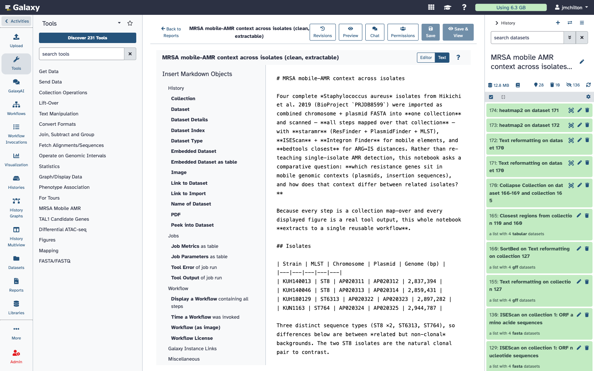

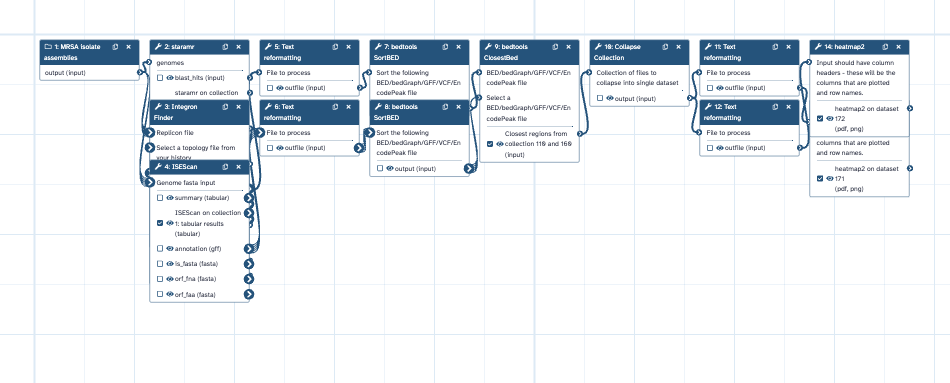

**Figure 2 — embedded-output exemplar.** The two mobile-resistome `ggplot2_heatmap2` outputs the notebook embeds — extractable on-graph tool outputs, not pasted images (the visual payoff for the auditability argument).

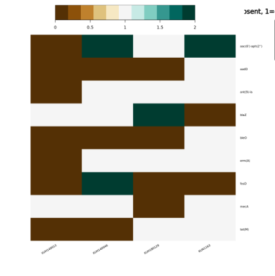

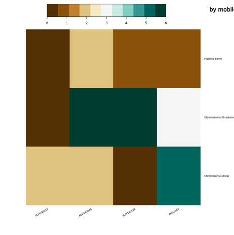

**Figure 3 — extraction outcomes across vignettes.** (a) Differential ATAC-seq application: the notebook (source authored through the MCP, then its rendered on-graph figures — DESeq2 PCA and volcano plot, and the ranked top condition-gained peak tables) beside the thirteen-step workflow extracted from it. (b) Differential-ChIP caller/comparator split: a map-over peak caller and a pairwise comparator, joined in final art by an "analyst picks the two conditions" seam. Table 1 accompanies this figure.

*(a) notebook source authored through the MCP — Galaxy-flavored markdown whose `history_dataset_as_image` and `history_dataset_as_table` directives reference on-graph tool outputs:*

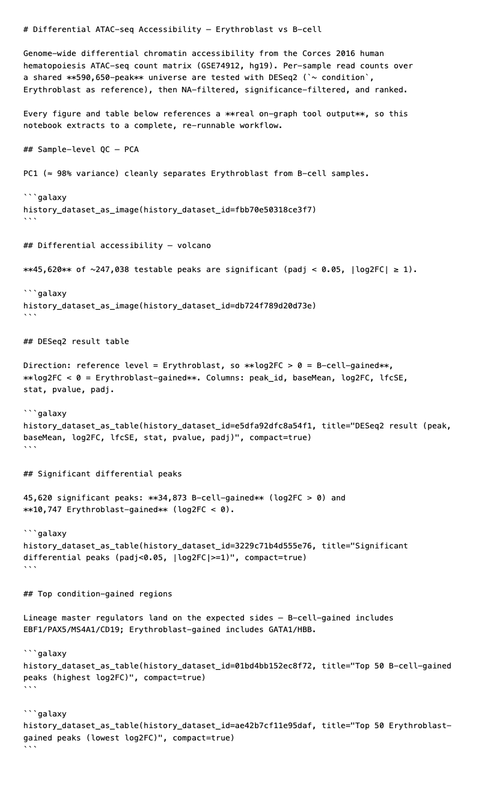

*(a) rendered notebook — sample QC (PCA, PC1 ≈ 98% variance) and the differential-accessibility volcano, both on-graph image outputs:*

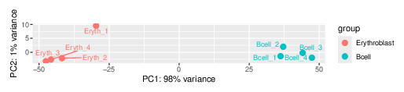

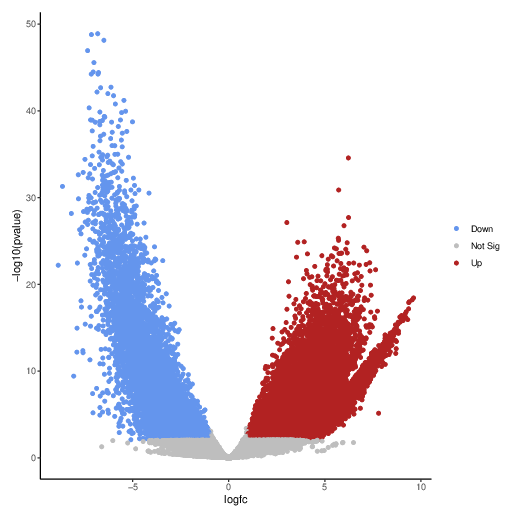

*(a) rendered notebook — significant peaks and the ranked top condition-gained tables (on-graph tabular outputs):*

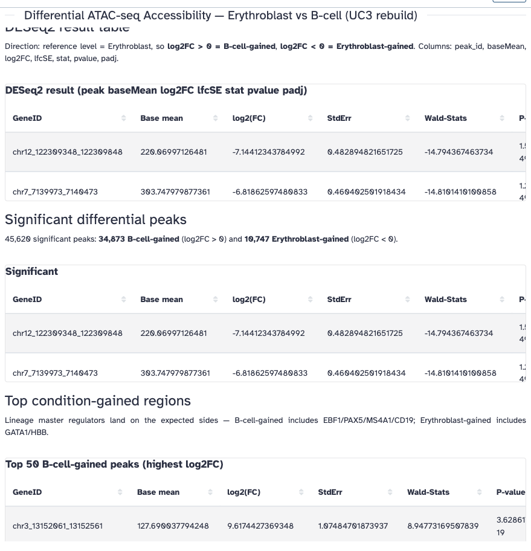

*(a) the thirteen-step workflow extracted from the notebook (counts collection + sample sheet → DESeq2 → NA-filter → volcano ∥ significance-filter → sort → top-gained / top-lost, plus the two image-output branches for the PCA and volcano figures):*

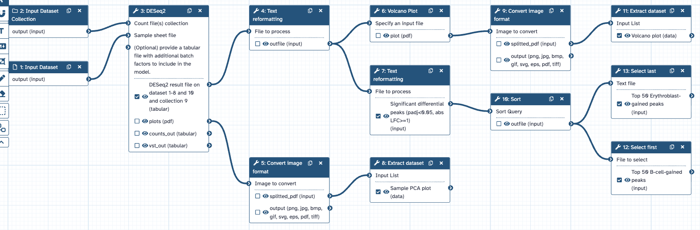

*(b) map-over peak caller (5 steps):*

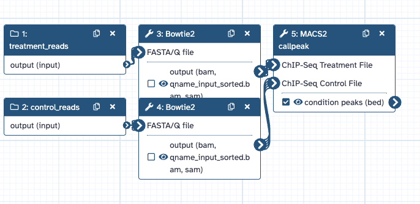

*(b) pairwise comparator (29 steps):*

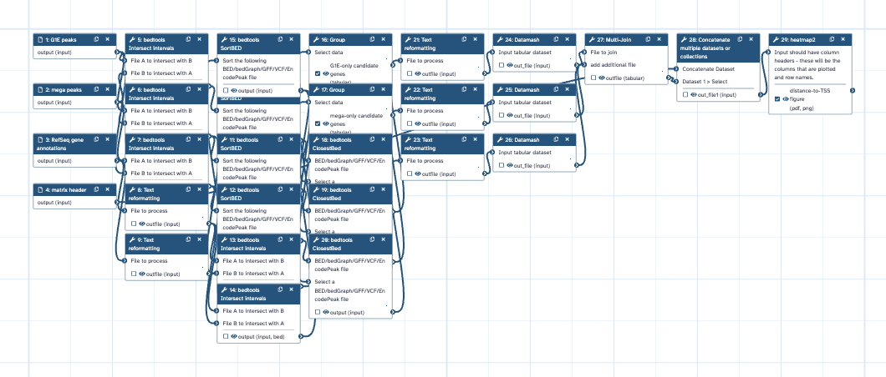

**Figure 4 — agent authorship is attributable.** The revision history of the mobile-resistome notebook, which was authored entirely through Galaxy's MCP: four agent-authored revisions (`edit_source="agent"`, badged *AI*) above the initial pre-feature revision. A reviewer can see at a glance which content an agent wrote — the concrete instance of evidence layer 4. (This notebook is all-agent; the model also distinguishes user- and restore-authored revisions, not shown here.)

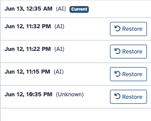

## Related Work

Galaxy Notebooks sit between several established bodies of work.

First, they build on Galaxy's history and workflow model for accessible, reproducible analysis [Goecks 2010; Abueg 2024]. Galaxy's core contribution has always been that users can run sophisticated tools without writing shell scripts while retaining provenance and reusable workflows. Galaxy Notebooks extend that model to the communication layer.

Second, they relate to computational notebooks and literate programming [Knuth 1984; Kluyver 2016; Rule 2019]. Jupyter and related systems combine code, prose, and results in one interactive artifact. Galaxy Notebooks share the goal of bringing explanation close to computation, but not the execution model. Galaxy execution remains in histories and workflows; the notebook is a narrative and artifact-reference layer over that execution.

Third, they relate to reproducible research guidance and workflow systems [Sandve 2013; Wratten 2021; Amstutz 2022]. Those systems emphasize scripts, workflows, environments, version control, and shareable artifacts. Galaxy Notebooks add a complementary claim: reproducibility also requires preserving the interpretation and report that make a computation understandable.

Fourth, they relate to provenance, scientific workflow reporting, and research objects [Davidson and Freire 2008; Moreau and Missier 2013; Belhajjame 2015; Soiland-Reyes 2022]. A workflow graph can show dependencies, but a reader still needs to know which outputs were meaningful and why. By embedding artifact references in a durable narrative, Galaxy Notebooks give provenance a communication surface.

Fifth, they relate to tools that recover or package workflow structure from artifacts not originally authored as workflows. YesWorkflow recovers workflow information from structured annotations in scripts, while noWorkflow captures provenance from Python execution [McPhillips 2015; Pimentel 2017]. Galaxy Notebooks make a different tradeoff: Galaxy already captures execution provenance, so the notebook marks communicative intent and meaningful outputs while the history graph supplies the computational structure.

Finally, they relate to emerging work on AI agents for bioinformatics and scientific analysis [Boiko 2023; Mehandru 2025]. The durable contribution here is not a new agent benchmark. It is infrastructure that lets human and agent writing enter a shared, versioned, provenance-coupled document.

## Discussion

Galaxy Notebooks make a specific bet: the analysis document should be part of the analysis system. A researcher should be able to move from data, to computation, to interpretation, to reusable workflow without copying context across unrelated tools. The notebook does not replace histories or workflows. It gives them a narrative layer.

The most immediate benefit is human. Galaxy users need a place to write methods notes, embed outputs, and explain results while staying inside the history context. The versioned Page model supplies that place with relatively little new backend machinery.

The second benefit is review. Revision provenance makes document authorship inspectable. A reviewer can distinguish manual edits, agent-authored proposals accepted by a user, and restored content. This does not solve all authorship or accountability questions, but it gives Galaxy a concrete record rather than an invisible overwrite. The record extends to fully external authorship: the three vignette notebooks were written by an agent through Galaxy's MCP, and each of its edits entered the log as `edit_source="agent"`, so a reviewer can still separate agent-written interpretation from human-written interpretation after the fact. The differential-ChIP vignette gives a concrete example: a domain correction — that TAL1 occupies the *Gata1* locus only in the *GATA1*-null G1E line, not that GATA1 is active there — entered the notebook as an attributable revision rather than a silent overwrite.

The third benefit is reuse, and it is demonstrated rather than asserted. A notebook that identifies meaningful outputs is a better starting point for workflow extraction than an undifferentiated list of history jobs. The narrative says what matters; the artifact references and graph say what produced it. In the cleanest case, this connection is exact: the workflow extracted from the mobile-resistome notebook re-runs byte-identical to the validated original, so the workflow report can travel with a workflow that genuinely reproduces the documented analysis.

There are important limits, and the vignettes make several of them precise. The notebook cannot make an analysis scientifically correct; it can preserve the explanation given for an analysis, but a bad explanation remains bad, and `edit_source` is provenance, not quality control. The `remove_short_is` episode in the mobile-resistome study illustrates the boundary exactly: on-graph references made a misleading figure *auditable*, and a human caught and corrected it — the system surfaced the discrepancy, it did not validate the result automatically.

A second limit is structural rather than interpretive: a notebook's reproducibility value is bounded by what it displays. Extraction can only recover the computation behind artifacts the notebook actually references, so a figure that is a re-rendered copy rather than an on-graph tool output anchors nothing. This is as much a design pressure in the right direction as a limit — the most reproducible way to document a result is also the easiest way to seed its workflow — and even figures emitted as PDF can be brought on-graph as image outputs and referenced directly (as in the differential-accessibility vignette), so they seed extraction.

A third limit is topological. Not every documented analysis reduces to a single sample-agnostic workflow. The irreducible two-way comparison in the differential-ChIP study extracts as a complete but condition-pinned workflow, and full reuse requires splitting it into a map-over caller and a pairwise comparator. The notebook surface makes that boundary visible rather than hiding it, and the split is the route to reusability — but the analyst still supplies the composition.

Finally, the contribution is bounded by breadth. The implemented notebook infrastructure, the graph-backed extraction path, and external agent authoring through the MCP are delivered behavior, anchored by three real analyses; broader coverage — additional analysis shapes and a domain-contributed vignette — is future work. The resource claim stands on that base: Galaxy Notebooks turn a documented history into the communication and report surface for reusable analysis.

## Methods

Galaxy Notebooks are implemented in Galaxy's existing Pages, markdown, chat, and history infrastructure. The backend changes extend `Page`, `PageRevision`, and `ChatExchange`; expose unified Page CRUD, revision, restore, and chat-history endpoints; and reuse Galaxy markdown rendering utilities for directive preparation. The page assistant is implemented in Galaxy's agent framework with structured output models and history-aware tools. External agents author notebooks through Galaxy's MCP server, which exposes the Page operations (create, read, update, revision listing, and revert) over the same operations layer; agent edits are recorded with `edit_source="agent"`.

The frontend is implemented in Vue 3 and Pinia. `PageEditorView` is the shared editor for Reports and Galaxy Notebooks. `HistoryPageView` provides notebook-context routing inside histories. Supporting components implement notebook lists, revision browsing, revision comparison, assistant chat, proposal diffs, section-level patches, and chat history browsing. Drag-and-drop uses Galaxy's existing history-panel drag infrastructure.

The three extraction vignettes were captured on the current Galaxy branch using page-based extraction. The mobile-resistome study uses BioProject PRJDB8599. The Supporting Information provides the reproduction recipes and extracted workflows in enough detail to reproduce the screenshots, the extraction sequences, and the byte-identical re-run.

## Availability

Galaxy Notebooks are developed in the open as part of Galaxy's history-attached Pages work. The page-based workflow extraction and the notebook MCP tools are each delivered through merged Galaxy pull requests. The reproduction recipes, extracted workflows, and tool-install lists in the Supporting Information carry enough detail to reproduce the figures, the extraction sequences, and the byte-identical re-run of the mobile-resistome workflow.

## Supporting Information

Supporting information provides everything needed to re-run the three vignettes and re-extract their workflows:

- **Reproduction recipes (SI Recipe S1–S3)** — server-agnostic, version-pinned recipes for the mobile-resistome, differential-ATAC-seq, and differential-ChIP vignettes, each with tool IDs and versions, input-data fetch, pipeline parameters, the notebook directives, and a verification table. SI numbering preserves the original artifact order: the manuscript's ATAC-seq Vignette 2 is Recipe S3, and the ChIP Vignette 3 is Recipe S2.
- **Extracted workflows (SI Workflow S1–S5)** — importable `.ga` files: the 14-step mobile-resistome workflow (S1); the 13-step differential-ATAC-seq workflow (S5); and the differential-ChIP single condition-pinned (S2), map-over peak caller (S3), and pairwise comparator (S4) workflows.
- **Tool-install lists (SI Data S1–S3)** — ephemeris/shed-tools YAMLs pinning the Tool Shed repositories per vignette.

These artifacts are pinned to the reference development server.

## References

Inline citations are keyed to `references.md`.
