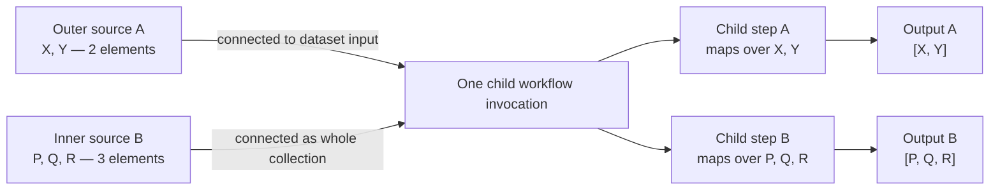
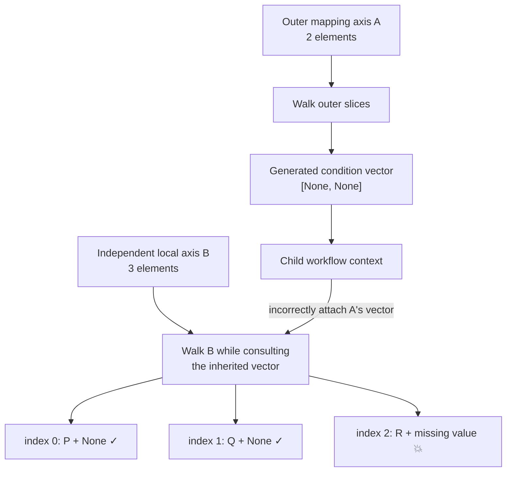
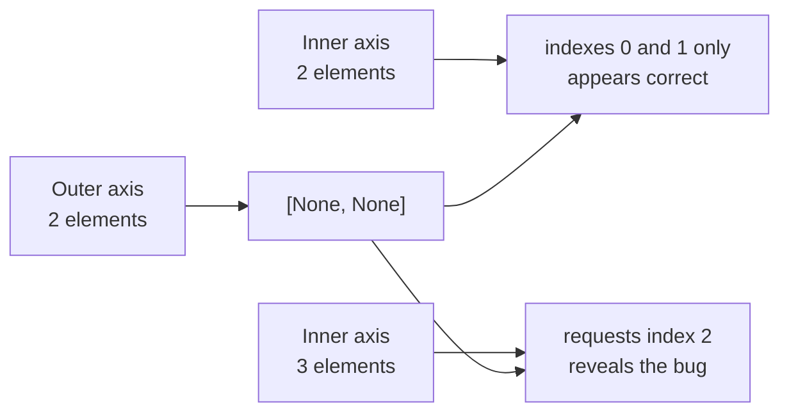

The bug is not “2 elements and 3 elements cannot coexist.” It is that Galaxy accidentally attaches metadata belonging to the two-element outer axis to the independent three-element inner axis.

## Intended execution

A subworkflow receives two collections:



Each executable child step chooses its own mapping source:

- Child step A sees collection A through a dataset input, so it maps twice.
- Child step B sees collection B through its own dataset input, so it maps three times.
- The mappings are independent; no 2×3 cross-product is implied.

## Where the accidental coupling came from

Before invoking the child workflow, `SubWorkflowModule` walks the outer mapping axis to evaluate the subworkflow’s `when` expression.

But this subworkflow has no `when` expression. Nevertheless, the old code produced one placeholder per outer element:

```text
Outer axis A:       X       Y
Condition result:  None    None

Stored vector: [None, None]
```

That vector was then carried into the child as though it were meaningful conditional state:



The actual failure occurs when the three-element tree does roughly this:

```python
when_value = self.when_values[index]
```

Conceptually:

| Inner element | Index | Inherited vector access | Result |
|---|---:|---|---|
| P | 0 | `[None, None][0]` | okay |
| Q | 1 | `[None, None][1]` | okay |
| R | 2 | `[None, None][2]` | `IndexError` |

That is why the original 2×2 test was dangerous:



Equal cardinality made two unrelated axes appear aligned.

## The fix

The new code recognizes that an all-`None` vector carries no conditional information and discards it in [modules.py](/Users/jxc755/projects/worktrees/galaxy/branch/workflow_semantics/lib/galaxy/workflow/modules.py:935):

```text
[None, None] → []
```

Real conditional vectors are retained:

```text
[True, False] → [True, False]
```

So the strengthened 2×3 test now proves that the two axes are genuinely independent.

One boundary remains intentionally unresolved: if the outer mapped subworkflow has a real per-slice `when`, Galaxy still needs an explicit policy for an unrelated inner axis—reject it, multiply the axes, or define some association rule. The revised documentation does not accidentally settle that larger design question.
