# Notebook Workflow Extraction

## TL;DR

Today you extract a workflow from a *whole history*. This adds extraction from a
*notebook page*: hit **Extract Workflow** in the page editor and Galaxy reads what
the notebook's markdown references — the datasets/collections it displays and the
jobs it discusses — walks their provenance backward, and lands you on the
extraction form with **just that subgraph pre-checked** and the referenced outputs
**pre-starred** as workflow outputs. Adjust or submit as-is.

On submit, the notebook travels *into* the workflow too: its markdown is rewritten
from history-instance ids to workflow-relative labels and stored as the workflow's
**report**, so the analysis story is portable to any instance.

Two directions across one notebook→workflow boundary: the page pre-fills the form
(§2–6), and the page becomes the extracted workflow's report (§7).

Part of #22709 (Workflow Extraction Overhaul meta-issue).

> _Note:_ the first four commits are enabling refactors (label tool steps, keep
> input/output labels unique, render mapped ICJ directives, drop dead report
> baking); notebook extraction proper starts at "Notebook Extraction".

---

## Summary

Galaxy can extract a reusable workflow from the work recorded in a history. This
feature extends that to **notebook pages**: when you extract a workflow *from a
notebook*, Galaxy reads what the notebook's markdown references — the outputs it
displays **and the jobs it talks about** (`job_metrics`, `tool_stdout`,
`tool_stderr`, `job_parameters`) — walks their provenance back through the history,
and pre-fills the extraction form so it describes exactly the analysis the notebook
tells a story about — instead of the whole history.

Three things are pre-computed for the form:

- **`seeded`** — the rows (tool steps + inputs) that lie on the provenance path
  behind the notebook's referenced outputs *and* behind any job the notebook
  references. The form pre-checks these.
- **`exposed`** — the specific outputs the notebook *displays*. The form pre-stars
  these as workflow outputs. A job the notebook merely references (e.g. "here are
  BWA's metrics") seeds that step but does **not** expose its outputs — showing
  metrics isn't the same as wanting the dataset as a workflow output.
- **`seed_warning`** — set on a row when the notebook references a *job* whose tool
  isn't a workflow step (an upload / data fetch). That job can't become a tool step,
  so it's seeded as a workflow input and the form explains why on the row.

A user opens a notebook, hits **Extract Workflow**, and lands on a form where the
producing subgraph is already selected and the referenced outputs are already marked
as the workflow's outputs. They can adjust and submit, or submit as-is.

When they submit, the notebook doesn't just seed the *form* — it also becomes the
extracted workflow's **report**. The page's markdown (history-instance ids) is
rewritten so every dataset / collection / job directive points at the new workflow's
inputs / outputs / steps **by label**, and stored as the workflow's `reports_config`.
The analysis story the notebook told travels with the workflow, portable to any
instance.

So the feature is two directions across one notebook→workflow boundary: the
**summary** path pre-fills the form *from* the page (sections 2–6), and the
**report** path carries the page *into* the extracted workflow (section 7).

This document describes the whole flow: the entry point, the summary endpoint, the
existing history-extraction layer it builds on, the backward provenance walk that does
the seeding, a gallery of worked scenarios, and the report rewrite that runs on
extract.

---

## Visual tour

> **TODO (tour):** the seven `<label>.png` images are **generated and verified** —
> they live in `/tmp/extract_tour/` (all 4 notebook + 1 step-label Selenium tests
> passed against a live `extract_next` server, 2026-06-09). What's left is **upload +
> link**: drag each into the PR description (or commit to a docs assets dir) and
> replace the `TODO` link. The framework writes both `<label>.png` and a near-identical
> `<label>-1.png`; **use the non-suffixed file**. Labels in backticks are the
> `screenshot()` labels.

**1. The notebook tells a story.** A history-attached page displays the outputs an
analyst cares about, with an **Extract Workflow** action in the editor toolbar.

<!-- TODO(tour): notebook_extract_seeded_notebook.png -->


**2. One click → a pre-filled form.** Extraction opens with **only the producing
subgraph of the referenced output pre-checked** (not the whole history) and the
referenced output **pre-starred** as a workflow output.

<!-- TODO(tour): notebook_extract_seeded_form.png -->


**3. It understands collections.** Referencing a map-over output collection seeds the
**mapped (ICJ) step** as a single card and the collection it was mapped over as one
input — the topology survives, it doesn't scatter into element jobs.

<!-- TODO(tour): notebook_extract_seeded_mapped_form.png -->


**4. Graceful when there's nothing to seed.** Open the form from a notebook that
references nothing extractable and it explains why nothing is pre-checked, rather
than dead-ending on a disabled button. (Full history still shown for manual picking.)

<!-- TODO(tour): notebook_extract_no_seed_form.png -->


**5. Labels make the report portable (aside).** The report rewrite leans on step/
output labels; the form now lets you label a tool step, which becomes the `step=`
target in the stored report.

<!-- TODO(tour): workflow_extract_step_label_affordance.png / workflow_extract_step_labeled.png -->


### Generating the tour images

```bash
# from the Galaxy worktree, with a bootstrapped venv + a running test server
export GALAXY_TEST_SCREENSHOTS_DIRECTORY=/tmp/extract_tour
pytest lib/galaxy_test/selenium/test_notebook_workflow_extraction.py
pytest lib/galaxy_test/selenium/test_workflow_extraction.py -k step_label
# images land in $GALAXY_TEST_SCREENSHOTS_DIRECTORY/<label>.png
```

**TODO (tour) checklist:**
- [x] Run the two Selenium runs above to produce the seven `<label>.png` files.
      _(Done 2026-06-09 — all tests passed; files in `/tmp/extract_tour/`.)_
- [x] Sanity-check each capture (right page, no auth/error banners, content legible).
      _(All clear after fixing a render race: each `screenshot()` now waits for a
      settled element — card checkbox / active star / no-seed banner — and beat 1 waits
      for the tool panel so its "Loading Toolbox" spinner doesn't leak in. Beat 1 keeps
      the editor view, palette and all, by choice. Shots are full-window; crop to the
      toolbar/form region when embedding.)_
- [ ] Upload to the PR (drag-drop into the description for GitHub-hosted URLs, or
      commit under a docs assets dir) and swap each `TODO` link for the real URL.
- [ ] Decide whether step 5 stays an aside or moves into §7 (report path); drop it if
      the four notebook frames carry the tour on their own.
- [ ] Optionally add a §5 scenario capture (`workflow_extract_reduce_collection`) if
      the reduction case needs a picture, but those are history-path shots, not the
      notebook entry point — keep the tour notebook-first.

---

## 1. The flow end to end

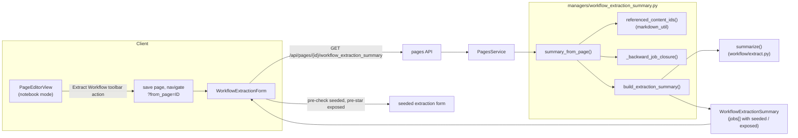

The notebook path reuses the same serializer as plain history extraction. The only
difference is that the page path computes a **closure** from the notebook's
references and passes it in; the history path passes nothing. The serialized shape is
identical — the history path simply leaves every row unflagged.

The endpoint is access-gated: `400` when the page has no attached history, `403` when
the requesting user can't access that history — so a shared or published page can
never leak the full-history job graph to someone who can't already see it.

---

## 2. The seed: what a notebook references

A notebook page is Galaxy markdown built from directives. `referenced_content_ids()`
runs the same access-checked directive walk the renderer uses (not a regex) and
records the datasets, collections, **and jobs** the page points at:

| Directive | Records |
|---|---|
| `history_dataset_display`, `..._as_image`, `..._as_table`, `..._peek`, `..._embedded`, `..._info`, `..._name`, `..._type` | an HDA (content ref) |
| `history_dataset_collection_display` | an HDCA (content ref) |
| `job_metrics`, `tool_stdout`, `tool_stderr`, `job_parameters` | a **job** — a plain job id, or an **ICJ id** if the referenced job is part of a map-over |

Everything else (workflow displays, instance links, …) records nothing. The result
is a `ReferencedContent` carrying three deduped lists: **content refs**
(`("hda", id)` / `("hdca", id)`), **`job_refs`** (plain job ids), and **`icj_refs`**
(implicit-collection-jobs ids). All three become starting points of the provenance
walk.

**Job-vs-ICJ is decided at the directive boundary.** The collector holds the
resolved (representative) `Job` — Phase 1's access-checked `_job_for_job_directive`
already ran `get_accessible_job` for it — so it folds at the source: a job that
belongs to an `ImplicitCollectionJobs` is recorded as its **ICJ id** (a map step);
a plain job is recorded as its **job id**. A `job_id=` directive that happens to
point at one element job of a map is therefore folded to the whole map, never left
as a stray element job.

---

## 3. The layer below: a history as an extractable job graph

Workflow extraction is built on `galaxy.workflow.extract.summarize(trans, history)`,
which scans a history's **visible contents** and produces a flat map:

```
job (or pseudo-job)  ->  [ (output_name, content), ... ]
```

Each entry becomes one row in the summary. The interesting part is how each kind of
content maps to a "job":

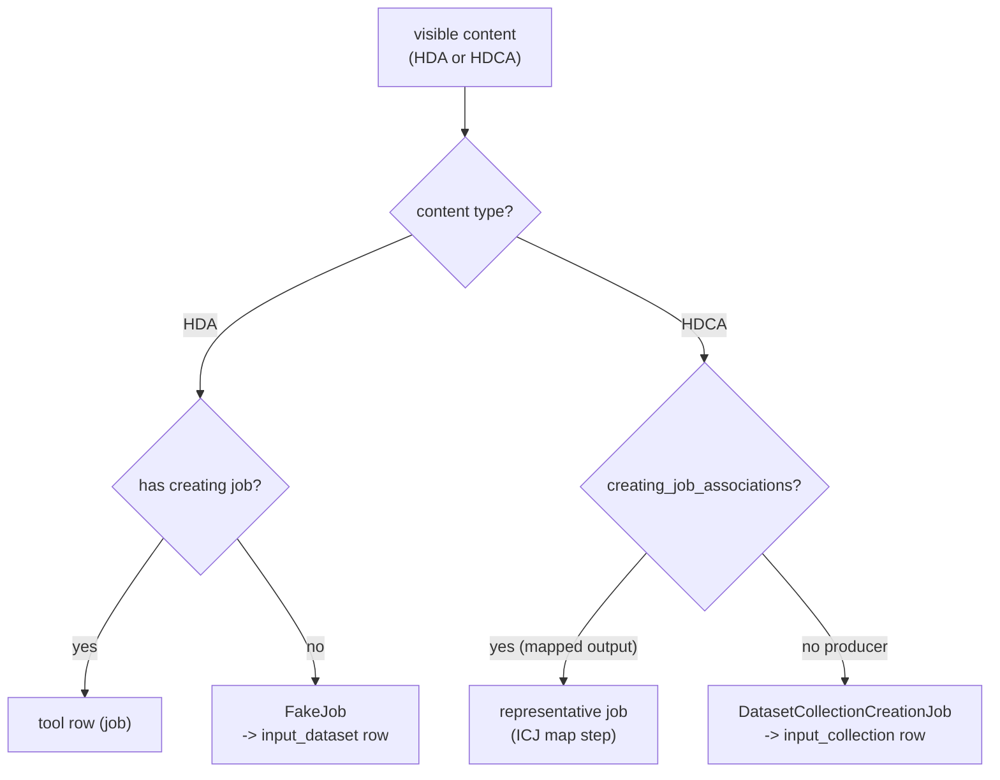

Three model facts the provenance walk is built around:

- **Identity is the original.** A dataset or collection copied between histories is
  followed to its *original* via `_original_hda` / `_original_hdca`, and keyed by the
  original's id. A copied collection therefore appears in the summary under the
  **source** id, with its in-history hid tracked separately.
- **A map-over is one step.** Mapping a tool over a collection runs one job per
  element; those jobs are grouped by an `ImplicitCollectionJobs` (ICJ) record and the
  output is an implicit HDCA. Extraction treats the whole map as a single step, keyed
  by the **ICJ**, not the individual element jobs.
- **A map-over's input collection lives on its output.** The collection a tool was
  mapped over is recorded on the *output* HDCA as `implicit_input_collections`
  (resolved via `find_implicit_input_collection`). The per-element jobs record only
  the individual *elements* they consumed. So the collection-level input edge of a map
  is read from the output collection, and the element edges are the same edge viewed
  per-job — the walk follows the collection-level one.

`build_extraction_summary` serializes each row into a `WorkflowExtractionJob`:

```
WorkflowExtractionJob
  step_type: tool | input_dataset | input_collection
  tool_id / tool_version / tool_version_warning
  checked            # default heuristic: any non-deleted output
  seeded             # on the producing subgraph of a referenced output or job
  seed_warning       # job-referenced non-step (upload) seeded as an input
  implicit_collection_jobs_id / _size
  invalid            # tool missing / inaccessible
  outputs[]:
    id, hid, name, state, deleted, history_content_type
    output_name, suggested_name
    exposed          # this output is referenced by the notebook
```

---

## 4. The backward provenance walk

`_backward_job_closure(trans, refs, job_refs, icj_refs, history_id)` is a
breadth-first walk **up** the provenance graph from the notebook's referenced
content to the edges of the producing subgraph, flagging everything it crosses.

**Job references reuse the same walk.** A job directive gives us a *job*, not
content — but the walk already knows how to go backward from content to its
producing job, enqueue that job's inputs, and recover map-over edges. Rather than
re-implement all of that for a job seed, the walk **enqueues the referenced job's
outputs, unexposed**, as extra starting points:

- a **`job_ref`** → enqueue all of the job's output HDAs/HDCAs (visible or not —
  seeding re-derives the job from any one output's `creating_job_associations`);
- an **`icj_ref`** → enqueue the ICJ's implicit output HDCAs, so the existing
  map-over recovery reads their `implicit_input_collections` for free.

Because these outputs are enqueued but **not** added to `referenced_output_refs`,
the producing step ends up `seeded` while its outputs stay **unexposed** — exactly
the BWA-metrics case: the step is pulled in, its reads/reference inputs walk back as
inputs, and nothing is starred. The ICJ id is fetched bare here (no re-gate);
access was already enforced at the collector, and a comment at the resolution site
records that precondition so a future caller can't reach the closure with an
unchecked id.

If a `job_ref`'s tool is **not** a workflow step (upload / data fetch /
cross-history), its outputs are still enqueued (so it surfaces as a seeded *input*
row) **and** their content keys are recorded in `seed_warning_refs`. The
compatibility check happens here, at the seed entry point, so the warning fires only
for a *directly* job-referenced non-step — an upload reached by an ordinary upstream
walk is not warned.

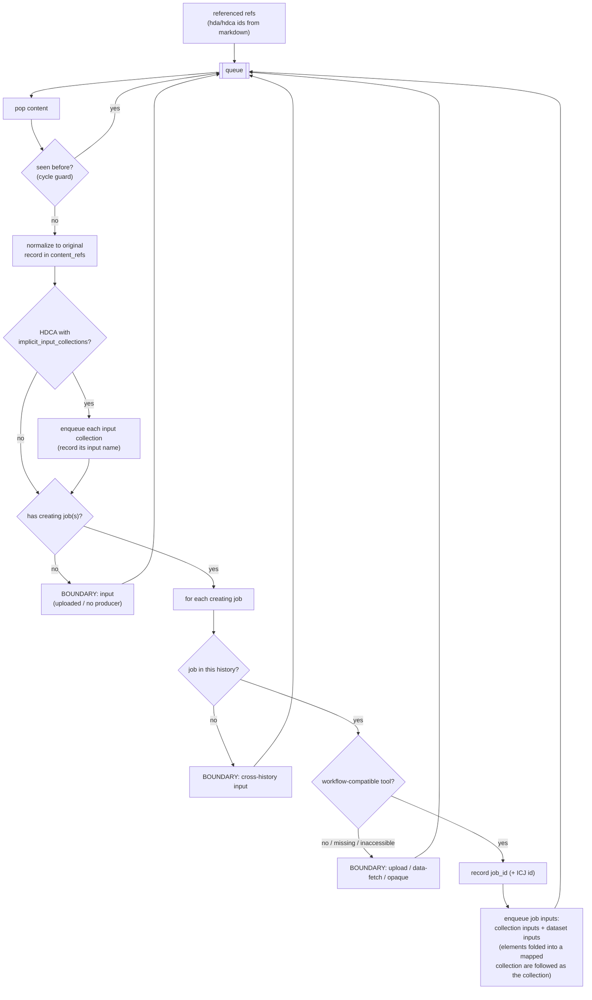

### What the walk collects (`ClosureResult`)

| Field                    | Meaning                                          | Drives                                |
| ------------------------ | ------------------------------------------------ | ------------------------------------- |
| `job_ids`                | producing tool jobs crossed                      | `seeded` on tool rows                 |
| `icj_ids`                | ICJs crossed (map steps)                         | `seeded` on *every* job in the ICJ    |
| `referenced_output_refs` | the notebook's referenced outputs                | `exposed` on outputs                  |
| `content_refs`           | every content visited                            | `seeded` on input rows                |
| `boundary_input_refs`    | edges (uploads, cross-history, opaque producers) | synthesizing cross-history input rows |
| `seed_warning_refs`      | outputs of a directly job-referenced non-step    | `seed_warning` on that input row      |
| `warnings`               | skipped / unavailable refs                       | surfaced to the form                  |

### How map-over inputs are recovered

When the walk reaches an implicit map output collection, it reads that collection's
`implicit_input_collections` and enqueues the **input collection** directly, recording
the input's name. The map's per-element jobs would otherwise expose only the
individual elements they consumed; because those elements belong to a named mapped
collection, the walk follows the collection (already enqueued) rather than scattering
into loose element datasets. The result is a clean collection-level edge: the
collection a tool was mapped over is seeded as a single input collection, exactly as
it will appear in the extracted workflow.

### Boundaries — where the walk stops

1. **No creating job** — uploaded / pasted data → an input.
2. **Non-workflow-compatible tool** — `upload1`, `__DATA_FETCH__`, … the data exists,
   but the producer isn't a workflow step → an input.
3. **Missing / inaccessible tool** — e.g. a user-defined tool the requester can't see
   → boundary (and never `seeded` — an invalid row can't be extracted anyway).
4. **Cross-history producer** — the job that made this content lives in another
   history; a foreign job can't be pulled into this extraction → an input.

### Two safety properties

- **Cycle guard.** `seen_content` / `seen_jobs` make the walk terminate even on
  self-referential provenance.
- **ICJ folding.** Recording an `icj_id` marks *all* element-jobs of that map
  `seeded`, though the walk only ever touches the representative job.

---

## 5. Scenario gallery

Legend:

- 🟦 boundary **input** (seeded input row)
- 🟩 **seeded** tool step
- ⭐ **exposed** (referenced by the notebook)

### 5.1 Linear chain (datasets)

> Notebook references the `cat1` output; walk back through two uploads.

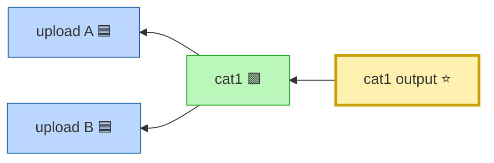

Both uploads are non-workflow-compatible producers → boundary inputs, seeded. The
`cat1` job is seeded; its output is exposed.

### 5.2 Map-over

> A pair collection is mapped over by `random_lines1`; notebook references the
> **implicit output collection**.

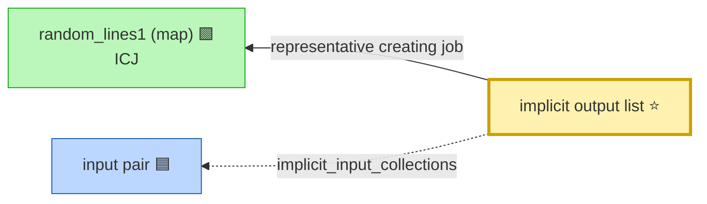

The output collection's `implicit_input_collections` give the collection the tool was
mapped over; it is enqueued and seeded as a single input collection. The map step is
seeded via its ICJ, and the referenced output is exposed.

### 5.3 Reduction over a mapped collection

> Pair → `random_lines1` (map) → `multi_data_param` (reduction); notebook references
> the reduction's dataset output.

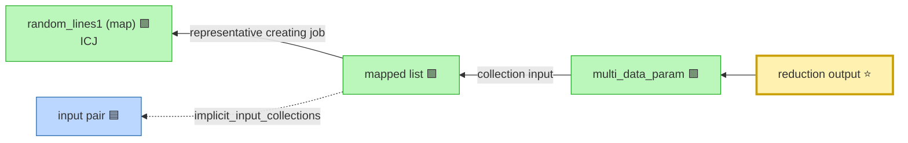

Two collection edges in one walk: the reduction consumes a whole collection (followed
as a collection input), and that collection is itself a map output (followed back to
the original pair). All of {reduction, map, input pair} are seeded.

### 5.4 Collection-producing tool (no map-over)

> Dataset → `collection_split_on_column` (produces a real list) → `cat_list`
> (reduces it); notebook references the final dataset.

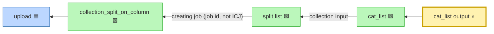

Here the collection is produced by an ordinary tool job (not a map), so it has direct
`creating_job_associations` and is seeded by **job id** rather than an ICJ.

### 5.5 Copied collection — cross-history boundary + normalization

> A collection produced in history A is copied into the notebook's history B; the
> notebook references the copy.

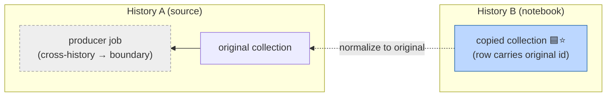

The copy is followed to its original for identity (the summary row carries the source
id), and A's producer job lives in another history — so it's a cross-history boundary
and surfaces as a seeded **input collection** rather than an extractable step.

### 5.6 Job directive — seed the producer, don't expose its output

> Notebook *displays no dataset* — it references the `cat1` **job** via
> `job_metrics(job_id=…)`. The step is pulled in; its output is **not** starred.

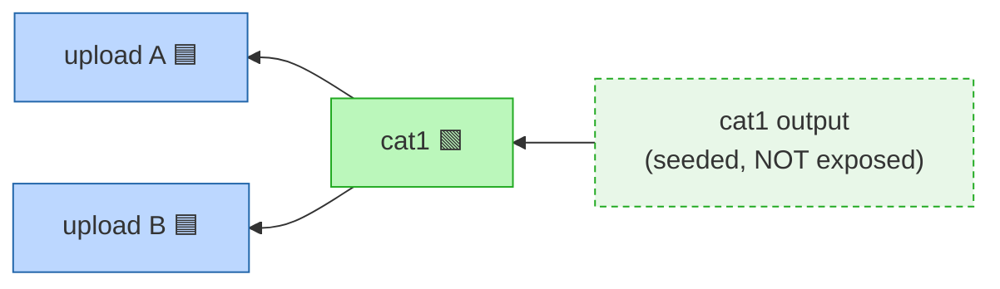

Same subgraph as 5.1, but the `cat1` output carries no ⭐: a referenced *job* seeds
its producing subgraph (job + upstream inputs) without exposing any output. A
map-over referenced via `job_metrics(implicit_collection_jobs_id=…)` (or
`job_id=<element job>`, folded to the ICJ) behaves like 5.2 with the output left
unexposed.

### 5.7 Job directive on an upload → input + `seed_warning`

> Notebook references an **upload** job via `job_metrics(job_id=…)`.

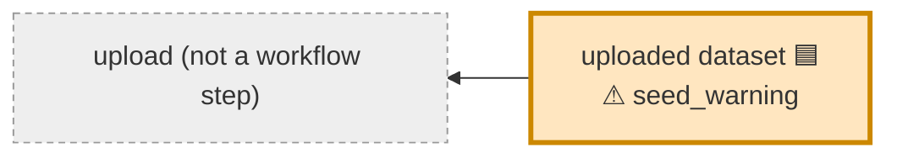

The upload's tool isn't workflow-compatible, so it can't be a tool step. It's seeded
as an **input** row, and because it was referenced *directly* by a job directive the
row carries a `seed_warning` the form renders ("Seeded as Input") explaining the
demotion. An upload reached only by an ordinary upstream walk (as in 5.1) gets no
such warning.

---

## 6. From closure to flags

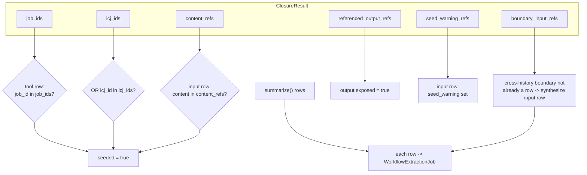

- **Tool rows** are seeded when their `job_id` is in `job_ids` **or** their ICJ id is
  in `icj_ids` (all element-jobs of a map share one seeded step).
- **Input rows** (uploads, input collections, fake jobs) are seeded when their content
  is in `content_refs`.
- **Outputs** are exposed when their content is in `referenced_output_refs`.
- **`seed_warning`** is set on an input row whose content is in `seed_warning_refs`
  (a directly job-referenced non-step). Computed in each row builder that holds the
  closure — the input-row path of `_extraction_row` and the synthesized cross-history
  inputs — and threaded into `_input_extraction_row` as a parameter rather than
  reaching into the closure from inside.
- **Cross-history boundary inputs** the whole-history summary didn't already surface
  are synthesized as input rows so they aren't silently dropped from the seed set.

---

## 7. Carrying the notebook into the workflow report

Everything above is the *summary* direction — reading the page to pre-fill the form.
This section is the reverse: on **submit**, the page that motivated the extraction
becomes the new workflow's report.

`POST /api/workflows/extract` (`extract_by_ids`) already builds a workflow from the
checked job/ICJ/dataset/collection ids. The payload now carries an optional
**`from_page_id`** (and `report_title`). When present, the service rewrites that
page's internal-id markdown into a **portable workflow report** and stores it on the
workflow's `reports_config`. A report must never embed a history-instance id, so each
directive is resolved to a workflow-relative label or dropped with a warning.

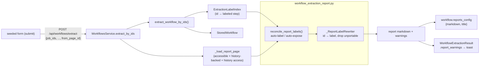

The rewriter is the **inverse of `resolve_invocation_markdown`**: where invocation
rendering turns workflow-relative labels into concrete instance ids, this turns a
notebook's concrete ids back into workflow-relative labels.

### 7.1 The label index

`extract_steps_by_ids` / `extract_workflow_by_ids` now return
`(steps/workflow, ExtractionLabelIndex)` — a caller that only wants the workflow
writes `stored, _ = extract_workflow_by_ids(...)`. The index maps each id the
extraction consumed to the step it became:

| Map | Key | Value |
|---|---|---|
| `content_to_step` | **original** HDA/HDCA id (`IdKey`) | `(WorkflowStep, output_name)` — extraction's own connection-wiring map, reused |
| `job_to_step` | plain job id | the tool `WorkflowStep` |
| `icj_to_step` | `ImplicitCollectionJobs` id | the single mapped tool `WorkflowStep` |

It holds **live `WorkflowStep` objects, not snapshotted label strings** — so a label
assigned *after* construction (by reconcile, below) is read back through the same
index. Three resolver methods turn a reference into a directive argument:

- `content_label_arg(kind, content)` → `input="x"` for a `data_input` /
  `data_collection_input` step, `output="y"` for a tool step's workflow output, or
  `None` (content not in the subgraph, or step/output unlabeled). Normalizes the
  content to its **original** id first, exactly as the connection wiring keys it.
- `job_label_arg(job)` → `step="z"`, **folding an element job to its ICJ** exactly as
  the seeding collector does.
- `step_for_content(...)` → the `content_to_step` lookup reconcile uses.

### 7.2 Reconcile — make every reference resolvable

`reconcile_report_labels` re-runs the same `referenced_content_ids()` walk over the
page, and for each referenced item that lands in the extracted subgraph but has **no
label yet**, generates one so the directive can resolve:

- a referenced **input** (data / collection step) with no label → labeled;
- a referenced **tool output** the user did not star → **exposed** as a workflow
  output with a generated label;
- a referenced **job / ICJ step** with no label → labeled.

Labels come from the same `suggested_name` chain the summary surfaces, deduped against
the shared step/output label namespace (`_used_labels` + `_generate_label`'s `_2`,
`_3`… suffixing). Items *outside* the extracted subgraph are left alone — the pure
rewriter drops them with a warning rather than inventing a label, so no instance id
can leak.

This is the one **decided design tradeoff**: the report is always complete (every
surviving directive resolves), at the cost of exposing outputs the notebook merely
*displays* but the user did not explicitly star. Reconcile **mutates the
just-extracted workflow** (step labels, new workflow outputs); the service commits
those alongside the report.

### 7.3 Rewrite — id → label, drop the unportable

`_ReportLabelRewriter` is a `GalaxyInternalMarkdownDirectiveHandler` subclass — the
same directive-walk family as `_ReferencedContentCollector`, so it inherits the
taxonomy and per-directive access checks rather than regex-matching. Per directive:

- **content directive** (`history_dataset_display`, `..._as_image`, …,
  `history_dataset_collection_display`) → substitute the encoded id with
  `content_label_arg`'s `input=`/`output=` argument.
- **job directive** (`job_metrics`, `tool_stdout`, `tool_stderr`, `job_parameters`) →
  substitute with `job_label_arg`'s `step=` argument.
- a content/job directive that **can't resolve** to a label → dropped with a warning.
- **id-bearing directives with no workflow-relative form** (history link, workflow
  display / image / license, invocation time / inputs / outputs) → dropped with a
  warning.
- **id-less directives** (instance links, generated version / time, visualizations) →
  pass through unchanged.

The rewritten markdown is run through `validate_galaxy_markdown` so a malformed
rewrite fails at *extraction* time, not at report-render time. Warnings returned to
the form are `referenced.warnings` (from the walk) + the rewriter's drop warnings, and
the frontend surfaces them in a "Some report directives were dropped" toast.

### 7.4 Gating

`_load_report_page` mirrors the summary endpoint's access model exactly: the page must
be **accessible**, must be **history-backed** (else `400` — reports only make sense for
notebooks), and the requester must have access to the **underlying history** — page
visibility alone must not leak the history a report is built from.

---

## 8. Components

**Backend**

- `markdown_util` — `_ReferencedContentCollector` + `referenced_content_ids()` reuse
  the directive-walk taxonomy and per-item access checks to collect referenced
  HDA/HDCA ids **and** job/ICJ ids (`ReferencedContent.refs` / `job_refs` /
  `icj_refs`); the four job-directive handlers fold an element job to its ICJ.
- `managers/workflow_extraction_summary` — the backward provenance walk
  (`_backward_job_closure`, now seeding `job_refs`/`icj_refs` and recording
  `seed_warning_refs`), the shared `build_extraction_summary`, and `summary_from_page`.
- `workflow/extract` — `extract_workflow_by_ids` / `extract_steps_by_ids` now return
  `(workflow/steps, ExtractionLabelIndex)`; the index (`content_to_step` /
  `job_to_step` / `icj_to_step`, holding live `WorkflowStep`s) resolves a referenced
  id to its `input=`/`output=`/`step=` directive argument.
- `managers/workflow_extraction_report` — `reconcile_and_build_report` (the service's
  one entry point): `reconcile_report_labels` auto-labels/auto-exposes referenced
  items, then `_ReportLabelRewriter` (a directive-walk subclass) rewrites the page's
  ids to labels and drops the unportable.
- `managers/workflow_extraction_naming` — `normalize_label` (whitespace-collapse +
  255-clamp), now shared by the service's `_sanitize_output_label` and report label
  generation, alongside the existing `suggested_output_name`.
- `schema/workflows` — `seeded` and `seed_warning` on `WorkflowExtractionJob`,
  `exposed` on `WorkflowExtractionOutput`; `from_page_id` + `report_title` on
  `WorkflowExtractionByIdsPayload`, `report_warnings` on `WorkflowExtractionResult`.
- `api/pages` + `services/pages` — `GET /api/pages/{id}/workflow_extraction_summary`
  with the 400 / 403 gating.
- `services/workflows` — `extract_by_ids` wires `from_page_id`: `_load_report_page`
  gates it, then builds and stores the report on `workflow.reports_config` and returns
  `report_warnings`.

**Frontend**

- `api/pages.ts` — `fetchWorkflowExtractionSummary(pageId)`.
- `WorkflowExtractionForm.vue` — on a `?from_page=` query, fetches the page summary and
  pre-checks `seeded` rows (instead of the default non-deleted heuristic) and pre-stars
  `exposed` outputs. A job-seeded row arrives with `seeded`/`checked` already set and
  flows through the existing seeded path; no new checked/seeded logic.
- `WorkflowExtraction/types.ts` + `WorkflowExtractionCard.vue` — `seed_warning` lives on
  `RowBase` (it lands on *input* rows, not just tool rows), is mapped in both
  `toExtractionRow` branches, and renders as a "Seeded as Input" warning badge on the
  card alongside the existing tool-version-warning badge.
- `PageEditorView.vue` — an **Extract Workflow** toolbar action (notebook mode only)
  that saves a dirty page, then navigates to the form with `?from_page=`. On submit,
  the form sends `from_page_id` and surfaces any `report_warnings` in a toast.

---

## 9. Testing strategy

The feature is three separable concerns, and each is tested at the cheapest layer
that can still test it faithfully. Pushing a test up a layer (e.g. re-proving graph
logic through a browser) buys no extra confidence and pays in speed and flakiness;
pushing it down loses the thing that actually needed checking.

| Layer | Concern it owns | Tests |
|---|---|---|
| **Collector** (unit) | Does the directive walk record the right content / job / ICJ refs, and fold an element job to its ICJ? | `TestReferencedContentCollector`: dataset / collection recording + dedup; **plain `job_id` → `job_refs`; `implicit_collection_jobs_id` → `icj_refs`; `job_id` on an element job → folded to `icj_refs`; inaccessible job → skipped with a warning** |
| **Closure** (unit) | Does the backward walk pick the right jobs/inputs and stop at the right boundaries? | provenance-mock tests: linear chains, the four boundaries, ICJ folding, copy normalization, cycle guard, map-over input recovery; **plain `job_ref` seeds subgraph (output unexposed); `icj_ref` seeds the mapped input; warn-only-when-directly-referenced; exposed+seeded dedup; multi-output no-mis-expose** |
| **Closure** (API) | Does the walk hold against a *real* server, real tools, real provenance? | `TestNotebookWorkflowExtractionSummary`: producer-seeds-and-exposes; map-over; reduction over a mapped collection; collection-producing tool (job id, no ICJ); copied collection; unreferenced-history; `400` / `403` gating; **`job_metrics` seeds producer unexposed; ICJ + element-job variants; upload job → seeded input + `seed_warning`** |
| **Translation** (vitest) | Does the form turn `seeded`/`exposed`/`seed_warning` flags into the right checked/starred state, badges, and submit payload? | `WorkflowExtractionForm` `from_page` block: pre-checks seeded / unchecks unseeded regardless of backend `checked`, pre-stars exposed, submits only the seeded subgraph; **seeded mapped row → `implicit_collection_jobs_ids` bucket**; **a row with `seed_warning` renders the warning badge, one without it does not** |
| **Report rewrite** (unit) | Does the index resolve ids → labels, and the rewriter substitute / drop correctly? | `test_extract_report`: rewriter (dataset→`output=`, collection→`input=`, job→`step=`, arg-preservation, unresolved-dropped, unportable-dropped, id-less passthrough); index (input/output/copied-normalization/plain-job/mapped-job-folds-to-ICJ/unlabeled-output-unresolved); reconcile (exposes unstarred output, labels unnamed input, labels referenced step, dedupes against existing label) |
| **Report rewrite** (API) | Does the rewrite hold against a real workflow + real provenance? | `TestWorkflowExtractionFromPage`: `from_page_id` rewrites output + job directives (no warnings); ICJ job directive → `step=`; `400` on a page without a history |
| **Wiring** (Selenium) | Does toolbar → endpoint → form → extract round-trip in a live browser? | `TestNotebookWorkflowExtraction`: two independent runs, only the referenced subgraph seeded + extracted; **a referenced map-over output seeds the mapped (ICJ) card and extracts via its ICJ**; toolbar button visibility |

### What we deliberately did *not* port to the UI

The collection-topology API tests — map-over, reduction, collection-producing tool,
copied collection — are **closure** tests. They exercise different shapes of the
*graph walk*, but the form renders all of them identically (a flat list of rows it
pre-checks by `seeded`); none introduces a distinct UI path. Re-running them through
Selenium would re-prove backend logic the API layer already pins, just slower. So they
stay at the API layer.

The same reasoning covers **job-directive seeding**: a job-seeded row is structurally
identical to any other seeded row in the form, and `seed_warning` is a per-row badge
covered by vitest. There is no new browser path, so no new Selenium test — only the
new closure/collector/API/vitest coverage above.

It also covers the **report rewrite**: it is pure server-side logic (index → reconcile
→ rewrite) with no UI surface beyond sending `from_page_id` and showing a warning
toast. The index/rewriter/reconcile logic is pinned by unit tests and the round-trip by
API tests; the only browser-observable behavior is the toast, not worth a Selenium run.

### The one gap that *was* worth adding at the UI layer

Cross-referencing those API tests against existing UI coverage surfaced a real,
untested seam: **a seeded pre-check meeting a mapped (ICJ) card.** A mapped card is a
structurally different UI object — keyed by `data-icj-id`, not `data-job-id`, and it
submits via `implicit_collection_jobs_ids`, not `job_ids`. Every prior seeded test
(vitest and Selenium) used plain job-id cards, so the combination "seeded + mapped +
extract via ICJ" had no coverage at any UI layer, even though each half existed
separately. We closed it twice: a **vitest** test for the translation seam (cheap,
deterministic) and **one Selenium** test for the live round-trip.

---

## 10. Trying it

### Manually

1. In a history, upload two datasets and run a tool that consumes them (e.g.
   `cat1`) so the history has a real provenance chain.
2. Open that history's **Pages** (notebook editor) and create a page that displays
   the tool's output — insert a dataset, or add a `history_dataset_display`
   directive by hand referencing the output's encoded id.
3. Click **Extract Workflow** in the page toolbar. (A dirty page is saved first —
   the summary reads the last saved revision.)
4. On the form, confirm: the `cat1` step is **pre-checked**, its output is
   **pre-starred**, and the two uploads appear as seeded **input** rows — the rest
   of the history is unchecked. Name the workflow and **Create**.
5. Open the created workflow's report: the page's markdown is rewritten to
   workflow-relative `output=`/`input=`/`step=` labels (no instance ids).
6. Edge cases to poke: reference a *job* via `job_metrics(job_id=…)` (step seeds,
   output stays unstarred); reference an upload job (seeds an input + a "Seeded as
   Input" badge); reference a map-over output collection (the mapped ICJ card
   pre-checks and extracts via `implicit_collection_jobs_ids`); open the form from a
   notebook that references nothing extractable (the form explains it seeded nothing
   rather than dead-ending on a disabled button).

### Automated coverage

| Layer | Run |
|---|---|
| Closure / collector (unit) | `pytest test/unit/app/managers/test_workflow_extraction_summary.py` |
| Report rewrite (unit) | `pytest test/unit/workflows/test_extract_report.py` |
| Summary endpoint (API) | `TestNotebookWorkflowExtractionSummary` in `test_pages_history_attached.py` |
| Report round-trip (API) | `TestWorkflowExtractionFromPage` in `test_workflow_extraction.py` |
| Form translation (vitest) | `WorkflowExtractionForm.test.ts` |
| Live round-trip (Selenium) | `test_notebook_workflow_extraction.py` |

API/Selenium tests build fixtures with the `new_notebook_referencing(history_id,
output_ids=…, job_ids=…, icj_ids=…)` populator helper.

---

## 11. Notes / follow-ups

- **Report auto-expose.** Reconcile exposes any output the notebook *displays* but the
  user did not star, so every directive resolves and the report is always complete.
  That means the extracted workflow can gain workflow outputs the user never explicitly
  asked for. Chosen for V1 (complete report > minimal output set); revisit if it proves
  noisy — the alternative is to drop unstarred-output directives with a warning instead.
- **Performance.** Producers are resolved per-seed (no batched provenance query) for
  V1; very wide fan-in histories may later warrant a batched load. Job-directive seeds
  resolve their job/ICJ per-seed too. The report path re-walks the page's directives a
  second time (`referenced_content_ids` in reconcile, then again in the rewriter).
- **Per-element metrics.** A map-over referenced via a job directive seeds the step via
  its ICJ; rendering still uses the representative job (Phase 1), and per-element
  metrics aggregation is out of scope.
- **Hidden-only producers.** A row is flagged only if `summarize()` produced one for
  it, and `summarize()` scans *visible* contents. A job whose every output is
  hidden/purged has no row to carry a `seeded`/`seed_warning` flag — noted as a
  warning, not a crash. Same constraint as the implicit-output note below.
- **Implicit output collections without `creating_job_associations`.** A rare data
  state (issue #22359) where a map output lost its direct job association; `summarize`
  has a leaf-element fallback for it but the provenance walk currently treats such a
  collection as a boundary. Best addressed with a targeted unit test and a mirrored
  fallback if it proves to matter in practice.
