# Models Visual Tour — `workflow_state_backfill`

Companion to [BOOKKEEPING_MODELS.md](BOOKKEEPING_MODELS.md). Same material, visual-first. Aimed at devs reviewing the PR.

---

## TL;DR card

```
ToolExecutionState (TES) is the new seam for tool-execution payloads.
TES owns its ToolSource (tool identity): one row knows its tool + its payload.
Four rows can carry a FK at TES: ToolRequest, Job, ICJ, WIS.
Supersession: ICJ > {Job, WIS}.  (TR may co-point with materialized side.)
Writers: services/jobs.py + workflow modules mint the TES, _execute stamps it.
Readers: History Graph + workflow extract both walk one resolver to the TES.id.
```

---

## 1. Schema — BEFORE / AFTER

### BEFORE (dev today)

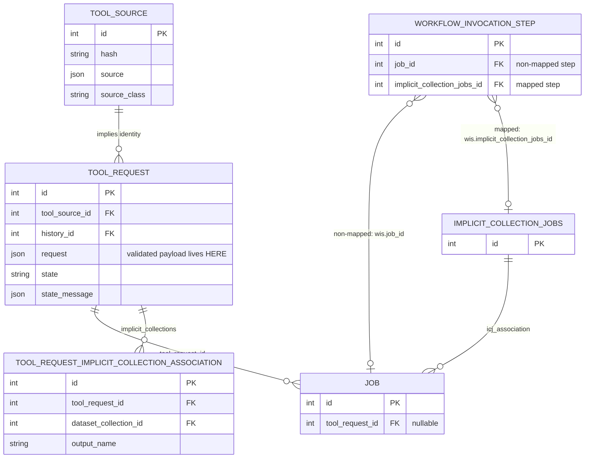

**Notice:**
- Tool identity is *implied* by the requester (no `tool_id` / `tool_version` columns on `ToolSource`).
- The validated payload only exists on `ToolRequest.request`. A workflow tool step has no payload row at all.
- `ToolSource.hash` is unconstrained; `hash='TODO'` rows accumulate.
- TRICA is the **producer-side** link for output HDCAs minted via the async tool-request API (closes the provenance gap for jobless / pre-job map-overs where no `JobToOutputDatasetCollectionAssociation` exists). It anchors on `ToolRequest`.

### AFTER (this branch)

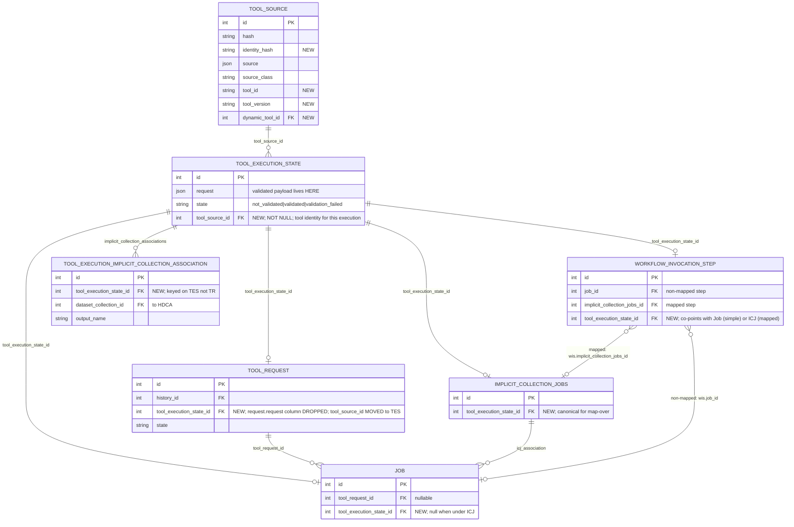

**Notice:**
- Tool identity hangs off the **execution event**, not the request. One uniform invariant: every TES knows its tool.
- Dedupe by `UNIQUE(hash, source_class, identity_hash)` on `tool_source`.
- One payload table, four inbound FKs. `tool_request.request` and `tool_request.tool_source_id` both gone — TES is the canonical owner of both payload and identity.
- **WIS has two execution-side FKs**: `job_id` for simple steps, `implicit_collection_jobs_id` for mapped steps. They are mutually exclusive at the row level.
- **TES co-pointing is the rule, not the exception.** For a workflow step, WIS holds its TES forever; once the execution materializes, the Job (simple) or ICJ (mapped) is stamped with the *same* TES row. No move, no null-out. The only TES-pointer invariant is "ICJ supersedes its constituent Jobs": a Job under an ICJ doesn't carry TES — the ICJ does. WIS freely co-points with either Job or ICJ.
- **All four TES back-pops are 1..[0,1].** Enforced by a partial-`UNIQUE(tool_execution_state_id)` on each of `tool_request`, `job`, `implicit_collection_jobs`, `workflow_invocation_step` (PostgreSQL/SQLite multi-NULL-under-UNIQUE keeps rows without a TES link legal).
- **TRICA → TEICA.** The producer-side bookkeeping was rekeyed off `ToolRequest` onto `ToolExecutionState`. `ToolExecutionImplicitCollectionAssociation` (TEICA) is written once at execute time alongside the HDCA mint; `HDCA.copy()` does not carry a TEICA row. Readers (History Graph, `tr.output_collections`, `tool_request_detailed_to_model`) walk `HDCA → TEICA → TES → ToolRequest`, and the join itself excludes copies — no `copied_from_*_id IS NULL` filter needed. The earlier "drop TRICA, walk via `HDCA → ICJ → TES → TR`" approach was reversed because that walk would return copies as if they were originals: `HDCA.copy()` inherits `implicit_collection_jobs_id`. TEICA preserves TRICA's write-once originals-only semantic.

Migrations: `0b49ffb1e890` (identity cols on tool_source), `28885b317f78` (TES table + backfill + drop request column), `29fe58dda936` (identity_hash + unique), `395148707459` (move tool_source_id from TR to TES), `10c4cd393d5a` (replace TRICA with TEICA + UNIQUE TES back-pops).

### AFTER, tiered by responsibility

Same model, organized by what each layer is responsible for. Read top→bottom: each tier consumes the one above and is referenced by the one below.

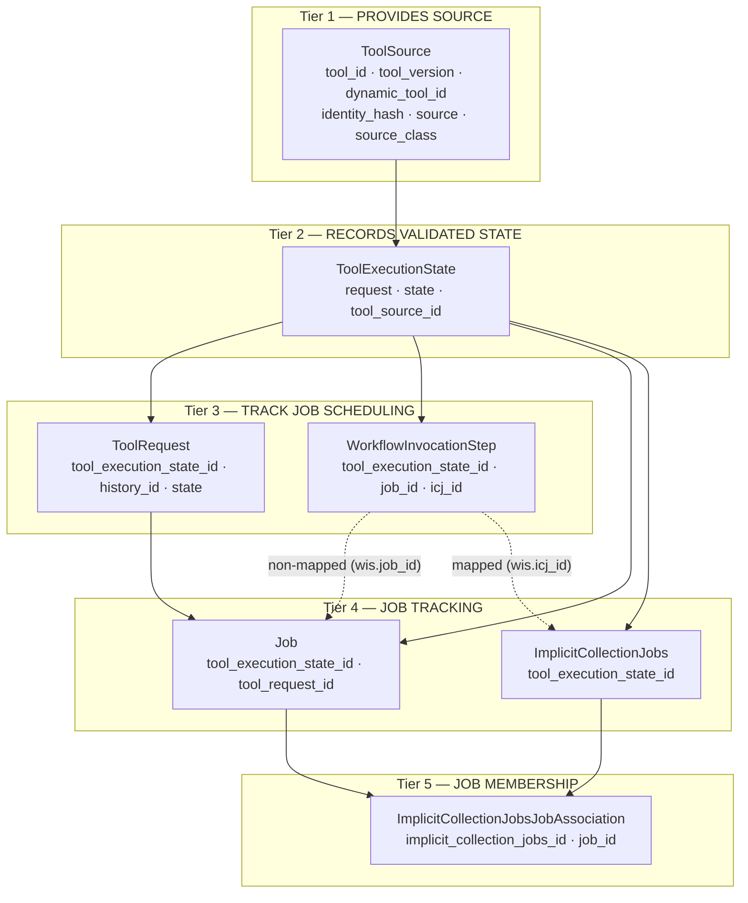

**How to read it:**
- Solid arrows = `tool_source_id` / `tool_execution_state_id` / `tool_request_id` / membership FK lineage (the canonical seam; arrow points from the referenced row down to the row carrying the FK).
- Dotted arrows = scheduling-time FKs that pin a JOB-tier row to its scheduling-tier owner (only one of `wis.job_id` / `wis.icj_id` populated per WIS row).
- Tiers 3 and 4 are **paired**: TR↔WIS are two scheduling surfaces (async-API vs workflow), JOB↔ICJ are two execution shapes (single vs map-over). Each pair shares the same TES seam.
- Tier 5 makes "ICJ supersedes its Jobs" mechanical: the invariant check walks ICJJA from an ICJ to its constituent Jobs and rejects any Job that also carries a TES FK. WIS can still co-point with either side at the same TES.

---

## 2. Who can own a TES row?

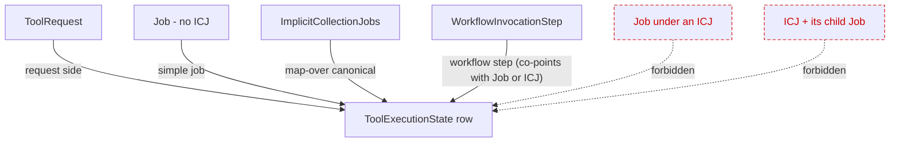

**The rule** (enforced by `__strict_check_before_flush__` on `Job` and `ICJ`):
ICJ supersedes its constituent Jobs. When the ICJ carries the link, no constituent Job may carry one too.

**Explicit co-pointing is allowed:**
- `ToolRequest` + materialized `Job`/`ICJ` at the same TES (request side + materialized side).
- `WIS` + `Job` (simple workflow step) at the same TES.
- `WIS` + `ICJ` (mapped workflow step) at the same TES.

---

## 3. Write paths

### 3a. Simple job (async tool-request API)

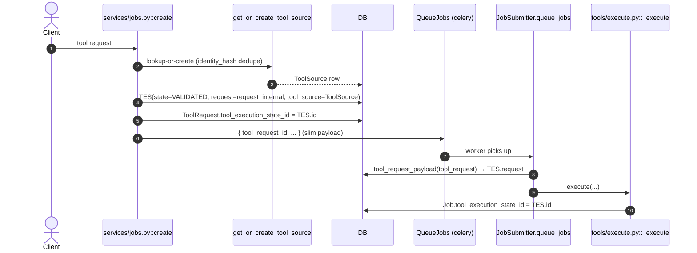

### 3b. Map-over (collection_info truthy → ICJ created)

Identical to 3a through step 8, then diverges:

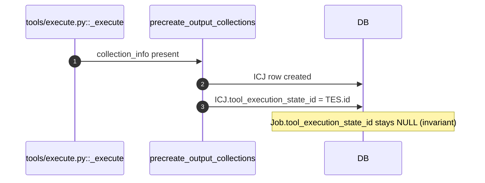

### 3c. Workflow tool step

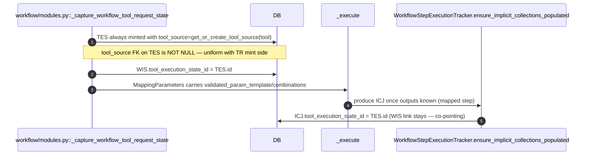

`_capture_workflow_tool_request_state` writes one TES per **step execution** (whole map-over), not per iteration. It uses `MappedCollectionInput` descriptors (`src=hdca|dce`, `map_over_type`, `linked=True`) instead of per-iteration sliced values — the converter re-applies the slice.

---

## 4. Read paths

### 4a. History Graph

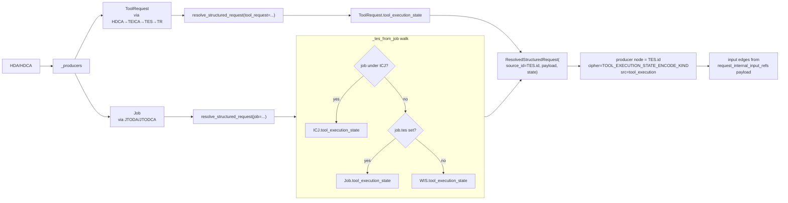

**Convergence** — three execution shapes, one producer node:

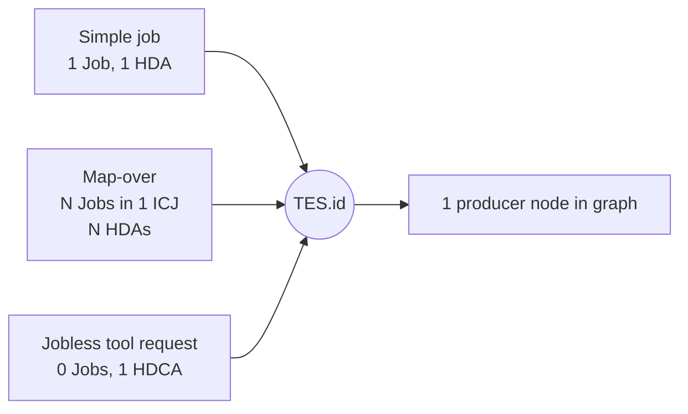

### 4b. Workflow extraction (`extract_steps_by_ids`)

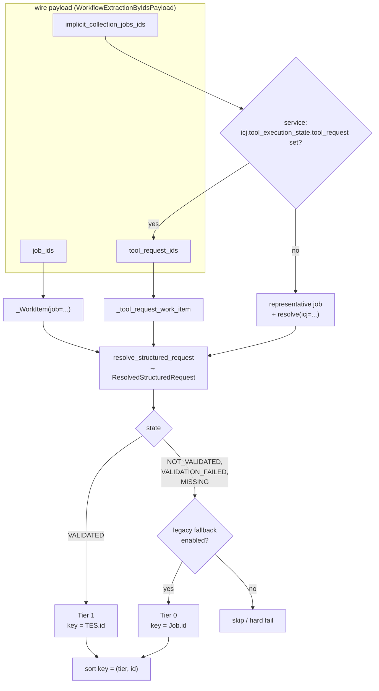

**Why this matters** — tier-1 ids share one comparable space (TES.id), so the two service-layer mix-guards (TR-keyed vs. job-keyed; job-keyed ICJs vs. TR-keyed ICJs) dropped out. They existed only because the underlying ids weren't comparable.

**Routing happens at the service.** `WorkflowsService.extract_by_ids` walks `icj.tool_execution_state.tool_request` for every submitted ICJ id and moves the TR-backed ones into `tool_request_ids` before invoking `extract_steps_by_ids`. Extract therefore sees a clean TR/ICJ split: the `implicit_collection_jobs_ids` loop handles classic map-overs only, and the prior per-HDCA peek through `tool_request_association` is gone.

Associations come from `request_internal_input_refs(payload)`, **not** `JobToInputDataset*` rows — so map-over connections wire to pre-map input HDCAs, not sliced elements.

---

## 5. Tool resolution — one helper

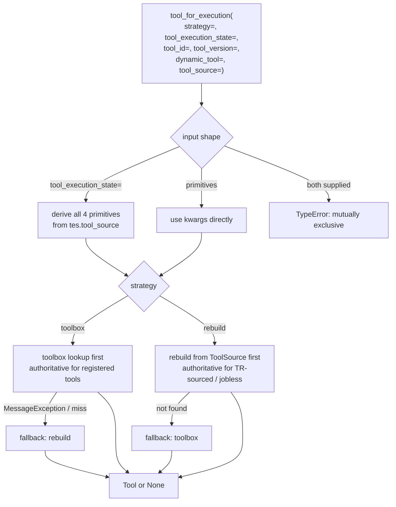

- `strategy=` is **required** (`"toolbox"` or `"rebuild"`) — no more inference from kwargs. `"rebuild"` was renamed from the prior `"model"`.
- `tool_execution_state=` is the preferred input shape: the TES carries every identity primitive symmetrically via its `tool_source`. Mutually exclusive with the primitive kwargs.
- `ResolvedStructuredRequest` now carries the producing TES, so extract routes it straight in without re-walking identity.
- Display sites (History Graph) get `None` on failure — `MessageException` is swallowed.
- Extract sites re-assert `tool is not None` because a missing tool at extract time is a hard failure.
- One call site for all three consumers: History Graph display, extract's job branch, extract's tool-request rebuild. The prior `_tool_from_request` / `_tool_for_job` inline helpers in `workflow/extract.py` are gone.
- Cache: rebuild path here is uncached; `galaxy.celery.tasks` keeps a worker-local `cached_create_tool_from_representation` for `queue_jobs`/`finish_job` hot paths. Collapsing the two cache homes is a documented follow-up.

---

## 6. Migrations at a glance

| Revision | Touches | Adds | Drops | Backfill |
|---|---|---|---|---|
| `0b49ffb1e890` | `tool_source` | `tool_id`, `tool_version`, `dynamic_tool_id` cols | — | Identity from existing requesters where derivable |
| `28885b317f78` | `tool_execution_state` (new), `tool_request`, `job`, `icj`, `wis` | TES table + 4 inbound FK cols | `tool_request.request` | One TES per `tool_request` (reuse id, 1:1); join to Job FK; null Job FK if Job has ICJ and stamp ICJ. WIS FKs left intact — WIS co-points with Job/ICJ at the same TES. |
| `29fe58dda936` | `tool_source` | `identity_hash` col + `UNIQUE(hash, source_class, identity_hash)` | duplicate rows (repoint to survivor) | Compute identity_hash; merge duplicates by repointing `tool_request.tool_source_id` |
| `395148707459` | `tool_execution_state`, `tool_request` | `tool_execution_state.tool_source_id` (NOT NULL FK) | `tool_request.tool_source_id`; orphan TES rows (no path to a ToolSource) | Copy `tool_source_id` from each TR to its linked TES; clear WIS link + DELETE any TES still NULL; promote column to NOT NULL |
| `10c4cd393d5a` | `tool_execution_implicit_collection_association` (new), `tool_request_implicit_collection_association`, `tool_request`, `job`, `implicit_collection_jobs`, `workflow_invocation_step` | TEICA table; `UNIQUE(tool_execution_state_id)` on each of the four TES-back-pop tables (partial via NULL-permissive UNIQUE) | TRICA table | Upgrade: create TEICA, lift TR-keyed rows via `tool_request.tool_execution_state_id` into TES-keyed TEICA rows, then drop TRICA. Skip TRICA rows whose TR has no TES (pre-EXEC_STATE imports). Downgrade: recreate TRICA, repopulate from TEICA via TES→TR. |

---

## 7. Glossary

| Term | Class | Role |
|---|---|---|
| **TES** | `ToolExecutionState` | Validated `request_internal` payload; one row per execution event |
| **TR** | `ToolRequest` | User-facing tool-request mint; request side of an execution |
| **ICJ** | `ImplicitCollectionJobs` | Canonical anchor for a map-over execution |
| **WIS** | `WorkflowInvocationStep` | Workflow tool step row; transient TES owner before ICJ exists |
| **TRICA** | `ToolRequestImplicitCollectionAssociation` | *Replaced by TEICA in `10c4cd393d5a`.* Was the TR-keyed producer link to output HDCAs. Still appears in the BEFORE diagram. |
| **TEICA** | `ToolExecutionImplicitCollectionAssociation` | TES-keyed producer link to output HDCAs. Written once at execute time; copies of an HDCA do not carry a TEICA row, so reader walks (`HDCA → TEICA → TES → TR`) naturally return originals only. |
| **JTODA / JTODCA** | `JobToOutputDataset(Collection)Association` | Job-side producer link |

---

## See also

- [BOOKKEEPING_MODELS.md](BOOKKEEPING_MODELS.md) — prose-level summary, commit list, file:line anchors.
- `lib/galaxy/managers/workflow_request_state.py` — `resolve_structured_request` resolver.
- `lib/galaxy/managers/tool_execution.py` — `tool_for_execution` helper.
- `lib/galaxy/managers/tool_source.py` — `get_or_create_tool_source`.
- `lib/galaxy/workflow/modules.py::_capture_workflow_tool_request_state` — workflow-side TES writer.
- `lib/galaxy/workflow/extract.py::extract_steps_by_ids` — read-side extract.
- `lib/galaxy/managers/history_graph.py` — read-side graph build.
