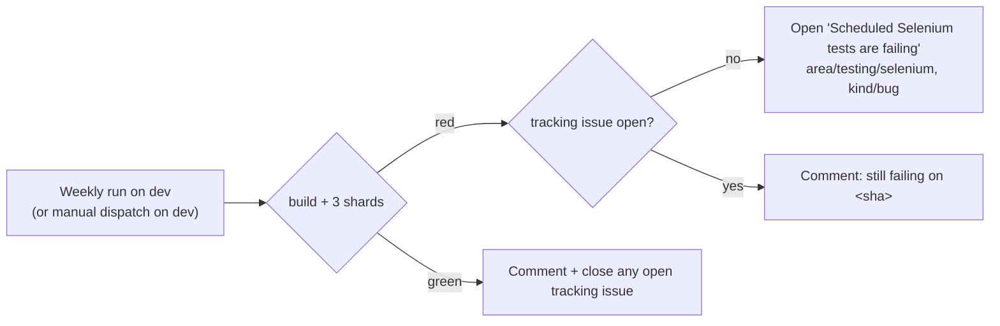

Follow-up to 🔀 #23976 - run the Selenium backend weekly on `dev` and track its failures in a GitHub issue.

Since #23976, no CI runs the Selenium backend, and the three tests marked `@selenium_only` run nowhere: tag editing in `test_histories_list`, drag-over styling in `test_history_pages`, and a `test_library_contents` case. This brings back `selenium.yaml` with only the original Tuesday cron and a manual trigger. A red run on `dev` now opens an issue instead of failing quietly in the Actions tab.

***Pull requests still run Playwright only — this adds no jobs to any PR.*** ***Cost is the Tuesday cron `selenium.yaml` ran before #23976: one client build plus 3 shards a week.*** ***It keeps a single self-closing issue for whoever maintains the Selenium backend; it blocks no PR.***

Cancelled runs report nothing, and manual runs on feature branches or forks never touch issues.

What changed against the deleted <code>selenium.yaml</code>

- **Triggers:** `schedule` (Tue 00:00 UTC, the original cron) and `workflow_dispatch`. The push/pull_request triggers and their per-job `if`s are gone.
- **Test job:** 3 shards on top of `build_client.yaml`, the same as before. The Codecov upload (`flags: selenium`) and failure artifacts are kept.
- **Settings:** the extended-metadata and outputs-to-working-directory overrides used to apply only on schedule. They are now top-level env, since every run is a scheduled-style run.
- **No `concurrency` block:** with `cancel-in-progress`, a manual dispatch would cancel that week's cron run and lose its result.
- **TEMP SSE/notification flags left out:** they were marked "revert before merge" and never reverted (🎯 #23983), so the weekly run tests shipping defaults.
- **New `report` job:**
  - Runs on `!cancelled()`, only on `galaxyproject` and only on `refs/heads/dev`.
  - Has job-scoped `issues: write`; the workflow's top-level permissions are `{}`.
  - Uses `actions/github-script`, like `maintenance_bot.yaml` and `labels-verifier.yaml`.
  - Finds the tracking issue by label, `github-actions[bot]` creator and exact title.
  - A passing run closes every match. Two overlapping failing runs could each open one.
- **Docs:** `writing_tests.md`'s CI section describes the weekly run and the issue.

Not done: the report logic could become a reusable `workflow_call` workflow. Nothing else would use it yet, because the other scheduled test workflows also run on PRs, where their failures are already visible.

## Risks

Risks are minimal - this change doesn't lock Galaxy into particular difficult to change choices (a two-way door).

Risk Details

- The only write it can make is to issues, on `galaxyproject/galaxy`, from `dev`.
- If someone relabels or retitles the tracking issue, the next failure opens a new one and the old one is never closed automatically.
- If the report job itself errors, the only signals are a red job and GitHub's scheduled-workflow email to whoever last changed the cron line.
- It can't be run upstream before merge: neither trigger exists until the file is on `dev`, the default branch. After merge, dispatch it once on `dev` as a smoke test.

## Context

Builds on 🔀 #23976, where mvdbeek suggested a scheduled run that opens an issue on failure. This is that suggestion.

## John's Checklist

- [ ] Did a human read every test and every comment? (Requires human author to check)
- [x] What does the user see when it fails? An open `area/testing/selenium` issue that links the failing run, with a comment for each later failure; the next green run closes it.
- [x] Is the diff free of unrelated or stale generated changes? Yes!
- [x] Are unit tests not just testing the literal implementation? N/A, there are no committed tests. Galaxy doesn't test its workflow files.
  

How the report script was checked

  - actionlint is clean.
  - zizmor reports only the low `self-repository` finding that `playwright.yaml` also has.
  - The script was run under node against a mocked `github`/`context`: create, comment, create when the build fails, comment + close, no-op.
  - The `creator=github-actions[bot]` filter was confirmed against the live API.

  

- [x] Are the comments free of excess archeology? Yes.
- [x] If comments contain some description of previous implementation, bugs, etc.. - what purpose do they serve? N/A

## How to test the changes?
- [x] Instructions for manual testing are as follows:
  

After merge

  1. Actions → Selenium tests → Run workflow on `dev`.
  2. Red: an issue titled "Scheduled Selenium tests are failing" opens, or the open one gets a comment.
  3. Green: any open tracking issue gets a comment and is closed.

  

## License
- [x] I agree to license these and all my past contributions to the core galaxy codebase under the [MIT license](https://opensource.org/licenses/MIT).

🤖 Generated with [Claude Code](https://claude.com/claude-code)
