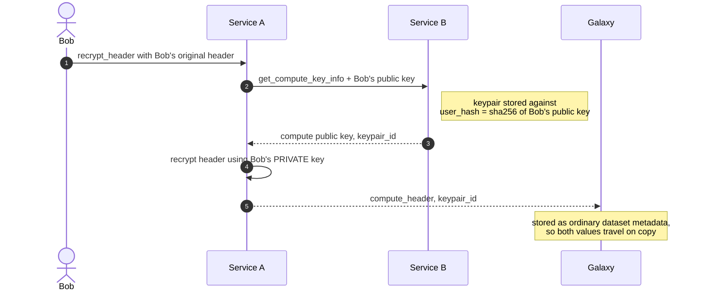
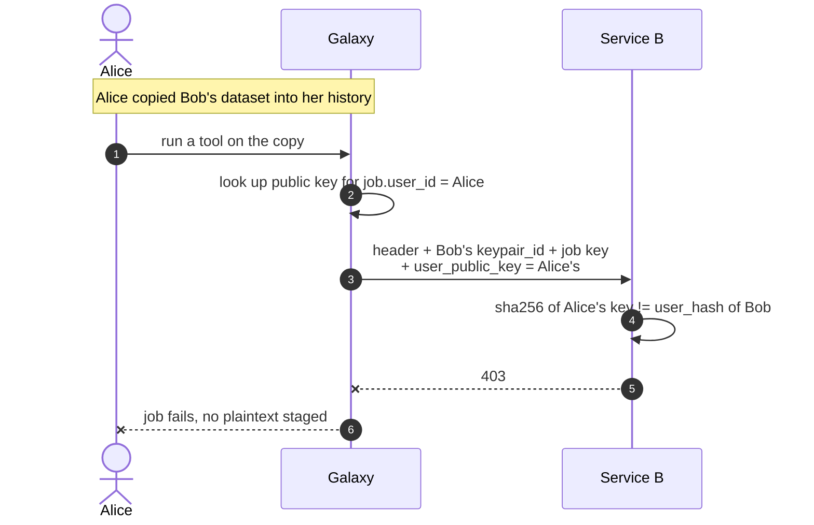
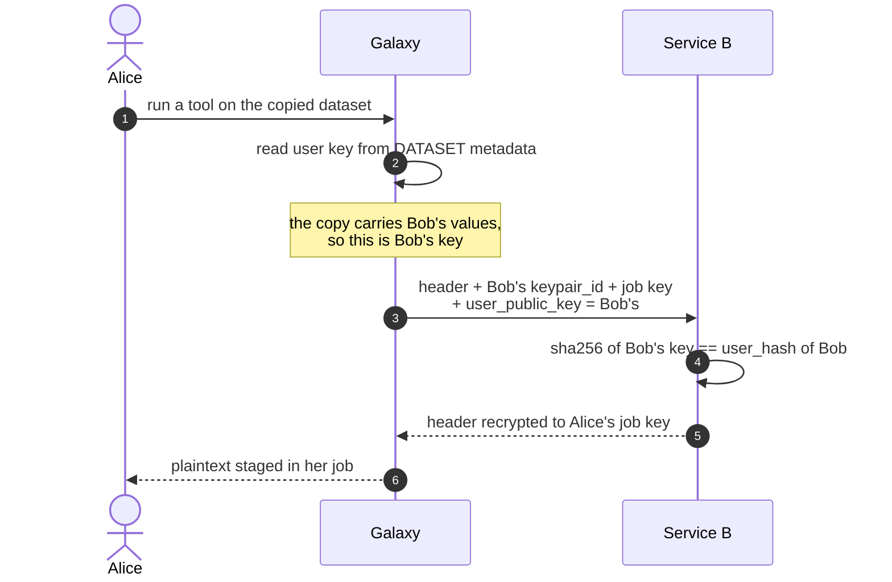
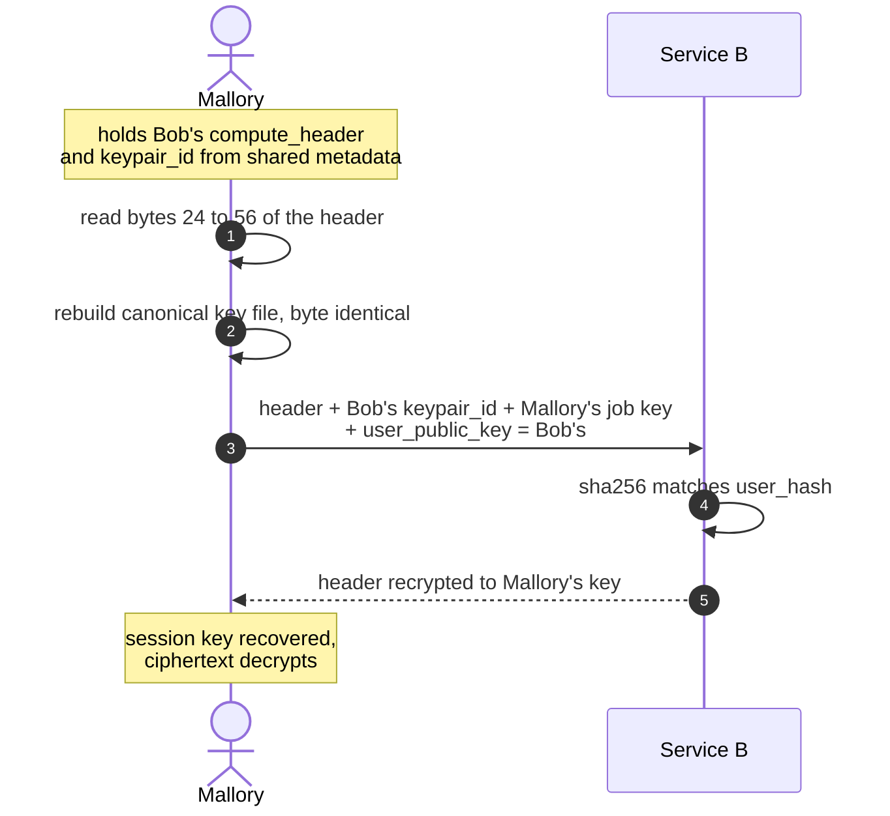
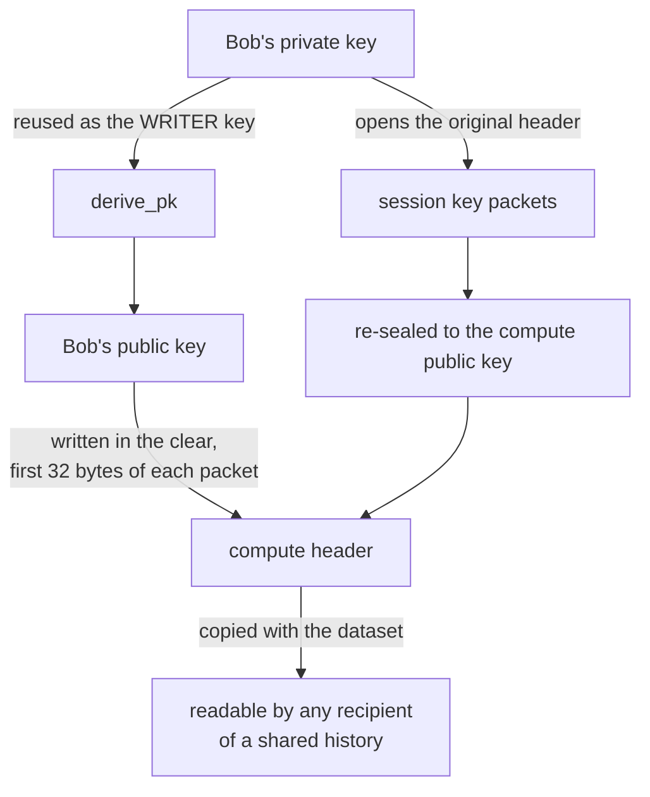

# Why the user-public-key check can't be load-bearing

Diagrams for the rejected easy fix — adding `crypt4gh_user_public_key` to
`/recrypt_header_to_job_key` and comparing it against the keypair's stored `user_hash`. Supporting
material for [[23277_user_public_key_leak]] and [[23277_recryptor_issue_body]].

## 1. Enrollment — where the binding comes from

Service B already ties every compute keypair to a user at allocation time. This part works and is
worth keeping.

## 2. What the check was meant to do

Galaxy sends the **job user's** public key; Service B compares it to the keypair's `user_hash`.

## 3. Failure one — sourcing the key from the dataset

Avoidable, but the likely implementation. Galaxy already reads `crypt4gh_compute_keypair_id` from
dataset metadata at `crypt4gh_remote_execution.py:486`, so reading the user key from the same place
is the path of least resistance — and it makes the check compare a value against itself.

## 4. Failure two — the value is not a secret

Unavoidable, and the reason the check can never stand alone. Even with correct sourcing in Galaxy,
anyone who can reach Service B directly reconstructs Bob's key from the header they already hold.

## 5. Why Bob's key is sitting in the header

Two facts compose:

- Crypt4GH method-0 packets are `writer_pubkey(32) || nonce(12) || ciphertext`, and the writer key
  **must** be in the clear — it is the Diffie-Hellman half the recipient needs to derive the shared
  key (`decrypt_X25519_Chacha20_Poly1305` reads `peer_pubkey = encrypted_part[:32]`).
- `do_recrypt_header` passes `(0, decryption_key, recipient_pubkey)`, reusing the key it just
  decrypted with as the writer key. So the writer stamped on Bob's compute header is Bob.

Neither is a defect. Exposing the writer key is required by the format; reusing the user's key
preserves sender provenance, which is what makes `sender_pubkey=` validation possible at all.

## What this does and does not prove

It **does not** show that a Galaxy-side per-user lookup is useless. Diagram 2 genuinely blocks
Alice — but only because Galaxy resolved the key from `job.user_id`. All the authorization is
happening in Galaxy at that point, and the wire field contributes nothing.

It **does** show that the field cannot carry authorization on its own, which is what the drafted PR
body claimed. And it shows that the same argument kills sender-key validation as authorization:
that proves the header was sealed by Bob's key, which stays true no matter who submits the request.

The fix is a value that never appears in any artifact — see [[23277_compute_authorization_plan]],
where Phase 1 closes the copy path Galaxy-side using compute-keypair isolation instead, and Phase 2
introduces an opaque token for the direct-caller case in diagram 4.
